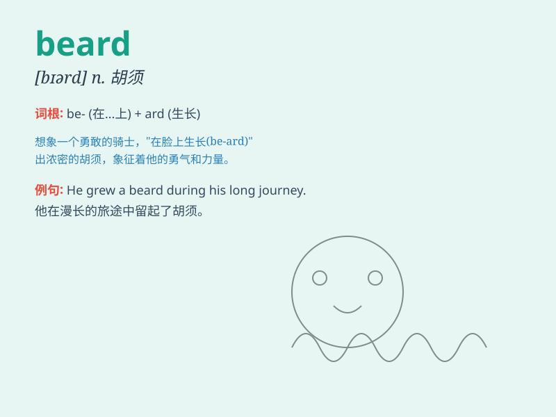

## beard

**英音:** _[bɪəd]_ **美音:** _[bɪrd]_

**译义:** *n.胡须*

### 短语

+ **full beard:** _浓密的胡须_

+ **beard growth:** _胡须生长_

+ **shave the beard:** _刮胡子_

+ **long beard:** _长胡子_

+ **beard trimmer:** _胡须修剪器_

### 例句

#### 例句1

> **He has a long and thick beard.**

**中文翻译:** 他留着又长又密的胡子。

**单词释义:** 胡子

#### 例句2

> **The old man\'s beard was white.**

**中文翻译:** 老人的胡子都白了。

**单词释义:** 胡子

#### 例句3

> **She tugged at his beard playfully.**

**中文翻译:** 她顽皮地拉扯他的胡子。

**单词释义:** 胡子

### 背诵小故事

> One day, a little boy saw a strange man with a long beard. The beard
was so thick and curly that it looked like a big bush. The boy was very
curious and kept staring at the beard. From then on, he always
remembered the word \'beard\'.

**有一天，一个小男孩看到一个奇怪的男人留着长长的胡子。那胡子又浓又卷，看起来像一大丛灌木。小男孩非常好奇，一直盯着那胡子看。从那以后，他就一直记住了'beard'这个单词。**

### 图义

