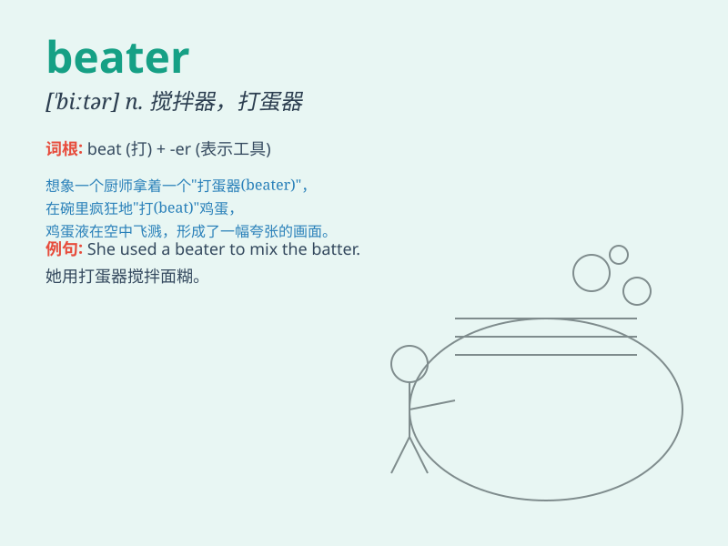

## beater

**英音:** _[\'biːtə]_ **美音:** _[\'bitɚ]_

**译义:** *n.搅拌器*

### 短语

+ **egg beater:** _打蛋器_

+ **carpet beater:** _地毯拍打器_

+ **drum beater:** _鼓槌_

+ **beater bar:** _搅拌棒_

+ **beater wheel:** _搅拌叶轮_

### 例句

#### 例句1

> **The beater of the drum was broken.**

**中文翻译:** 鼓的敲击器坏了。

**单词释义:** 鼓槌

#### 例句2

> **The egg beater is very useful in the kitchen.**

**中文翻译:** 打蛋器在厨房里非常有用。

**单词释义:** 打蛋器

#### 例句3

> **He\'s a beater for the local football team.**

**中文翻译:** 他是当地足球队的击球手。

**单词释义:** 击球手

### 背诵小故事

> One day, a chef was using a beater to mix the eggs for a cake. The
beater spun quickly, making the eggs smooth and fluffy. It was the
beater that did the magic!

**一天，一位厨师正用打蛋器搅拌鸡蛋来做蛋糕。打蛋器快速旋转，让鸡蛋变得光滑蓬松。正是打蛋器创造了这个神奇！**

### 图义

