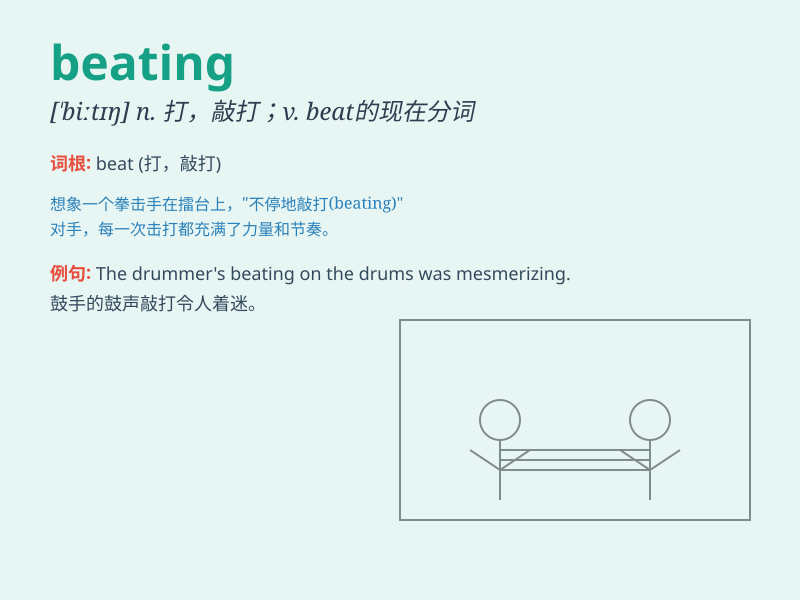

## beating

**英音:** _[\'biːtɪŋ]_ **美音:** _[\'bitɪŋ]_

**译义:** *v.挫败n.打,敲打*

### 短语

+ **take a beating:** _遭受重创；挨打；受到严厉批评_

+ **heart beating:** _心跳_

+ **beating drum:** _击鼓；敲鼓_

+ **beating pulse:** _跳动的脉搏_

+ **constant beating:** _持续的击打_

### 例句

#### 例句1

> **The boxer took a severe beating in the ring.**

**中文翻译:** 拳击手在拳击场上遭受了严重的打击。

**单词释义:** 殴打；打击

#### 例句2

> **My heart was beating fast when I saw her.**

**中文翻译:** 当我看到她时，我的心跳得很快。

**单词释义:** （心脏等的）跳动

#### 例句3

> **The rain was beating against the window.**

**中文翻译:** 雨点敲打着窗户。

**单词释义:** 拍打；敲击

### 背诵小故事

> A brave knight was on a quest. In a dark forest, he encountered a
fierce monster. After a tough fight, the knight gave the monster a
severe beating and saved the day. The beating showed his strength and
courage.

**一位勇敢的骑士正在执行一项任务。在一片黑暗的森林中，他遇到了一只凶猛的怪物。经过一场艰苦的战斗，骑士狠狠揍了怪物一顿并拯救了这一天。这次痛打展现了他的力量和勇气。**

### 图义

