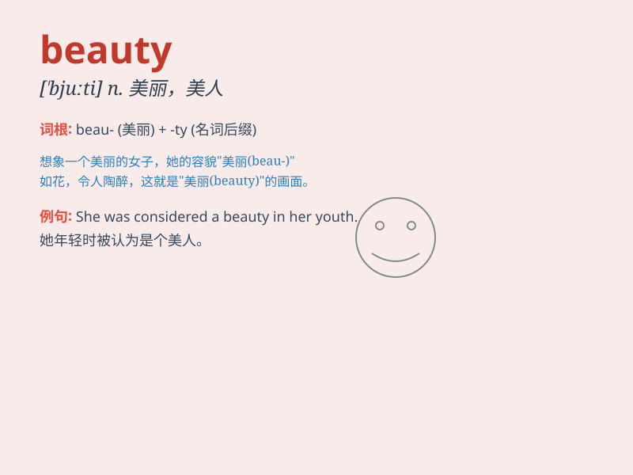

## beauty

**英音:** _[\'bjuːtɪ]_ **美音:** _[\'bjuti]_

**译义:** *n.美,美景,美好的东西*

### 短语

+ **beauty salon:** _美容院_

+ **natural beauty:** _自然美_

+ **beauty queen:** _选美皇后_

+ **beauty sleep:** _美容觉_

+ **inner beauty:** _内在美_

### 例句

#### 例句1

> **Her beauty took his breath away.**

**中文翻译:** 她的美貌让他屏息凝神。

**单词释义:** 美丽；美貌

#### 例句2

> **The beauty of the landscape was beyond description.**

**中文翻译:** 风景的美丽是无法形容的。

**单词释义:** 美丽；美好

#### 例句3

> **She is known for her inner beauty.**

**中文翻译:** 她以其内在美而闻名。

**单词释义:** 美；美好

### 背诵小故事

> A fairy appeared in a forest. Everyone was attracted by her charm.
Her face, smile, and every move were full of beauty. She made the forest
more enchanting. Remember, beauty can charm and enchant.

**一位仙女出现在森林里。每个人都被她的魅力所吸引。她的面容、微笑和一举一动都充满了美。她让森林更加迷人。记住，beauty
就是美，魅力。**

### 图义

