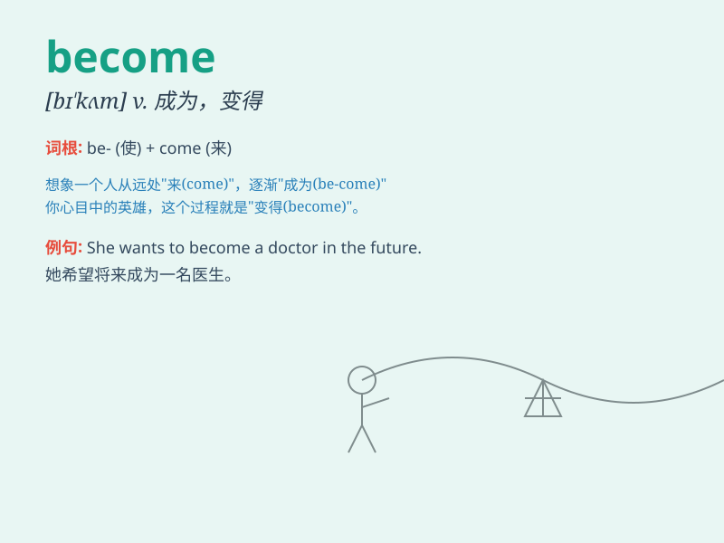

## become

**英音:** _[bɪ\'kʌm]_ **美音:** _[bɪ\'kʌm]_

**译义:** *vi.变成,成为,变得vt.适合,相称*

### 短语

+ **become of:** _（多用于疑问句）使遭遇，发生于_

+ **become involved in:** _卷入，参与_

+ **become accustomed to:** _习惯于_

+ **become aware of:** _意识到，知道_

+ **become famous for:** _因\...\...而出名_

### 例句

#### 例句1

> **She became a doctor after years of study.**

**中文翻译:** 经过多年的学习，她成为了一名医生。

**单词释义:** 成为

#### 例句2

> **The weather became colder as winter approached.**

**中文翻译:** 随着冬天的临近，天气变得更冷了。

**单词释义:** 变得

#### 例句3

> **He has become very interested in music recently.**

**中文翻译:** 他最近对音乐变得非常感兴趣。

**单词释义:** 变得

### 背诵小故事

> A little caterpillar dreamed of becoming a beautiful butterfly. It
worked hard, eating and growing. Finally, it transformed and became the
butterfly it had always wanted to be.

**一只小毛毛虫梦想着成为一只美丽的蝴蝶。它努力地吃着、成长着。最终，它蜕变了，成为了它一直想成为的蝴蝶。**

### 图义

