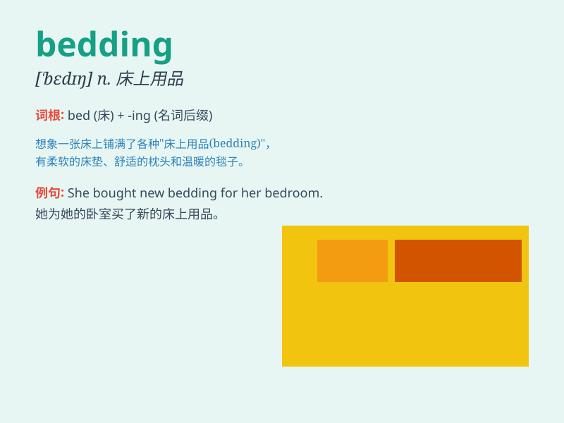

## bedding

**英音:** _[\'bedɪŋ]_ **美音:** _[\'bɛdɪŋ]_

**译义:** *n.被褥,(家畜)草垫,(建筑)基床*

### 短语

+ **bedding plant:** _花坛植物；盆栽植物_

+ **bedding material:** _垫料；床上用品材料_

+ **bedding down:** _（使）安睡；（为...）铺床_

+ **bedding out:** _移栽（幼苗）_

+ **bedding industry:** _床上用品行业_

### 例句

#### 例句1

> **I need to buy some new bedding for my bedroom.**

**中文翻译:** 我需要为我的卧室买一些新的床上用品。

**单词释义:** 床上用品

#### 例句2

> **The hotel provides clean and comfortable bedding for guests.**

**中文翻译:** 这家酒店为客人提供干净舒适的床上用品。

**单词释义:** 床上用品

#### 例句3

> **She was changing the bedding when I arrived.**

**中文翻译:** 我到的时候她正在更换床上用品。

**单词释义:** 床上用品

### 背诵小故事

> One day, I went to a hotel. When I opened the door of the room, the
first thing I saw was the beautiful bedding. It included a soft
mattress, a warm quilt, and fluffy pillows. They made me feel so
comfortable and cozy.

**有一天，我去了一家酒店。当我打开房间的门，首先看到的是漂亮的床上用品。它包括柔软的床垫、温暖的被子和蓬松的枕头。它们让我感到非常舒适和惬意。**

### 图义

