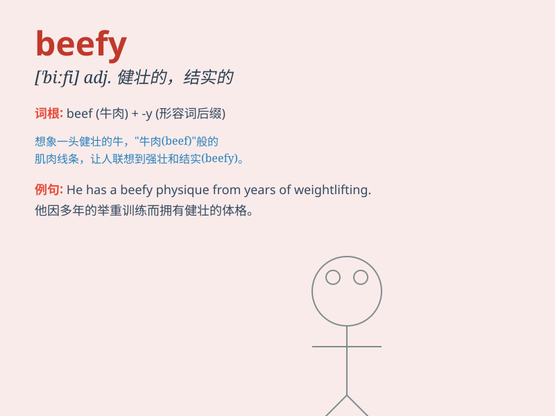

## beefy

**英音:** _[\'biːfɪ]_ **美音:** _[\'bifi]_

**译义:** *adj.象牛肉的,健壮的,结实的*

### 短语

+ **beefy arms:** _粗壮的胳膊_

+ **beefy man:** _强壮的男人_

+ **beefy muscles:** _结实的肌肉_

+ **beefy build:** _健硕的体格_

+ **beefy frame:** _魁梧的身材_

### 例句

#### 例句1

> **The wrestler had a beefy build.**

**中文翻译:** 这位摔跤手体格健壮。

**单词释义:** 强壮的；结实的

#### 例句2

> **The beefy man easily lifted the heavy box.**

**中文翻译:** 那个健壮的男人轻松地举起了沉重的箱子。

**单词释义:** 强壮的；结实的

#### 例句3

> **The new car has a beefy engine.**

**中文翻译:** 这辆新车有一个强大的发动机。

**单词释义:** 强大的；有力的

### 背诵小故事

> One day, a little boy saw a very strong and muscular cow. He said,
\'This cow looks beefy!\' It means the cow was big, strong and full of
muscles, just like someone who is powerful and robust.

**有一天，一个小男孩看到一头非常强壮、肌肉发达的牛。他说：'这头牛看起来很强壮！'这意味着这头牛体型大、强壮且肌肉满满，就像很强壮有力的人一样。**

### 图义

