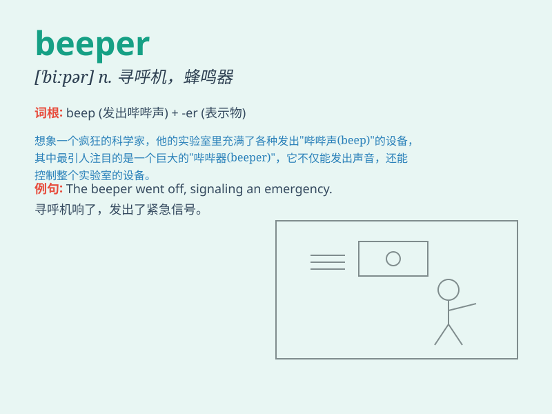

## beeper

**英音:** _[ˈbiːpə(r)]_ **美音:** _[ˈbiːpər]_

**译义:** *n.能发出哔哔声音的仪器*

### 短语

+ **pager beeper:** _传呼机_

+ **wireless beeper:** _无线传呼机_

+ **electronic beeper:** _电子传呼机_

+ **beeper system:** _传呼系统_

+ **beeper service:** _传呼服务_

### 例句

#### 例句1

> **The doctor always carries a beeper in case of emergencies.**

**中文翻译:** 这位医生总是随身携带寻呼机以防有紧急情况。

**单词释义:** 寻呼机

#### 例句2

> **I left my beeper at home and missed an important message.**

**中文翻译:** 我把寻呼机落在家里了，错过了一条重要消息。

**单词释义:** 寻呼机

#### 例句3

> **The old-fashioned beeper has been replaced by modern
smartphones.**

**中文翻译:** 老式的寻呼机已经被现代智能手机所取代。

**单词释义:** 寻呼机

### 背诵小故事

> One day, a doctor was in a hurry to save a patient. The beeper on his
waist kept beeping, telling him it was an emergency. He rushed to the
hospital immediately. The beeper was like a magic call that never
stopped.

**有一天，一位医生正着急去救一位病人。他腰上的传呼机一直响个不停，告诉他有紧急情况。他立刻冲向医院。传呼机就像不停歇的神奇召唤。**

### 图义

