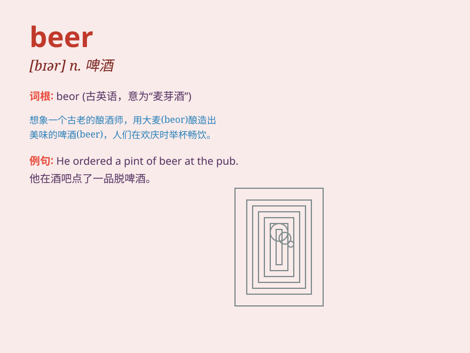

## beer

**英音:** _[bɪə]_ **美音:** _[bɪr]_

**译义:** *n.啤酒*

### 短语

+ **beer belly:** _啤酒肚_

+ **beer garden:** _露天啤酒店_

+ **beer mug:** _啤酒杯_

+ **craft beer:** _精酿啤酒_

+ **root beer:** _沙士（一种不含酒精的饮料）_

### 例句

#### 例句1

> **I enjoy a cold beer on a hot summer day.**

**中文翻译:** 在炎热的夏日，我喜欢喝一杯冰啤酒。

**单词释义:** 啤酒

#### 例句2

> **He ordered a pint of beer at the pub.**

**中文翻译:** 他在酒吧点了一品脱啤酒。

**单词释义:** 啤酒

#### 例句3

> **The brewery produces a wide variety of beers.**

**中文翻译:** 这家啤酒厂生产各种各样的啤酒。

**单词释义:** 啤酒

### 背诵小故事

> One hot summer day, a thirsty traveler was walking along a road.
Suddenly, he saw a tavern and rushed in. He ordered a cold beer and felt
so refreshed. The taste of that beer made his journey much better.

**在一个炎热的夏日，一位口渴的旅行者沿着道路行走。突然，他看到一家小酒馆，便冲了进去。他点了一杯冰啤酒，顿感神清气爽。那杯啤酒的味道让他的旅途变得美好许多。**

### 图义

