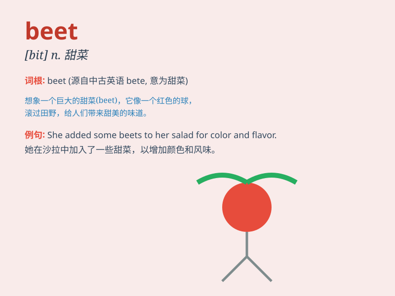

## beet

**英音:** _[biːt]_ **美音:** _[bit]_

**译义:** *n.甜菜,甜菜根vt.生火,修理,改过*

### 短语

+ **beet root:** _甜菜根_

+ **sugar beet:** _糖用甜菜_

+ **beet juice:** _甜菜汁_

+ **beet salad:** _甜菜沙拉_

+ **beet field:** _甜菜田_

### 例句

#### 例句1

> **I love eating beet salad.**

**中文翻译:** 我喜欢吃甜菜沙拉。

**单词释义:** 甜菜

#### 例句2

> **The farmer harvested a large amount of beets.**

**中文翻译:** 这位农民收获了大量的甜菜。

**单词释义:** 甜菜

#### 例句3

> **Beets are rich in nutrients.**

**中文翻译:** 甜菜富含营养。

**单词释义:** 甜菜

### 背诵小故事

> A little rabbit went to the farm and saw many red beets. It was very
happy because it loved the sweet taste of beets. So, it picked some to
take home. Now you remember beet - the red vegetable!

**一只小兔子去农场看到了很多红色的甜菜。它非常高兴，因为它喜欢甜菜甜甜的味道。所以，它摘了一些带回家。现在你记住
beet - 甜菜这个单词啦！**

### 图义

