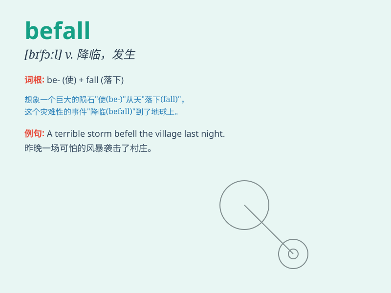

## befall

**英音:** _[bɪ\'fɔːl]_ **美音:** _[bɪ\'fɔl]_

**译义:** *v.降临,遭遇,加于*

### 短语

+ **befall someone:** _降临到某人身上；发生在某人身上_

+ **ill befall:** _不幸降临；灾祸发生_

+ **misfortunes befall:** _不幸降临；灾祸临头_

+ **calamity befall:** _灾难降临_

+ **disaster befall:** _灾害降临_

### 例句

#### 例句1

> **I fear some evil will befall her.**

**中文翻译:** 我担心她会遭遇不幸。

**单词释义:** 降临；发生

#### 例句2

> **What disaster might befall us next?**

**中文翻译:** 接下来我们会遭遇什么灾难呢？

**单词释义:** 降临；发生

#### 例句3

> **If any harm befalls you, I will be responsible.**

**中文翻译:** 如果对你造成任何伤害，我将负责。

**单词释义:** 降临；发生

### 背诵小故事

> One day, a poor traveler was walking in the forest. Suddenly, a storm
befell. He had no shelter and got completely wet. But he remained
hopeful, thinking this misfortune would pass.

**一天，一个可怜的旅行者在森林里行走。突然，一场暴风雨降临了。他没有遮蔽处，全身湿透了。但他仍然满怀希望，想着这场不幸会过去。**

### 图义

