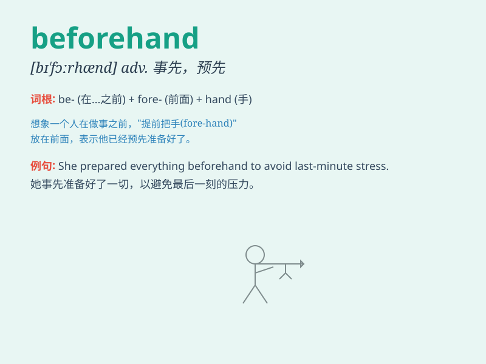

## beforehand

**英音:** _[bɪ\'fɔːhænd]_ **美音:** _[bɪ\'fɔrhænd]_

**译义:** *adv.预先*

### 短语

+ **know beforehand:** _事先知道_

+ **prepare beforehand:** _事先准备_

+ **arrange beforehand:** _事先安排_

+ **warn beforehand:** _事先警告_

+ **inform beforehand:** _事先通知_

### 例句

#### 例句1

> **I had made all the preparations beforehand.**

**中文翻译:** 我事先已经做好了一切准备。

**单词释义:** 事先

#### 例句2

> **Let me know beforehand if you can\'t come.**

**中文翻译:** 如果您不能来请提前通知我。

**单词释义:** 提前

#### 例句3

> **We were warned beforehand of the possible danger.**

**中文翻译:** 我们事先就被警告可能存在危险。

**单词释义:** 事先

### 背诵小故事

> Once upon a time, a smart student prepared his presentation
beforehand. He knew doing things in advance would make him shine. So, he
practiced and gathered all the materials before the big day came.
\'Beforehand\' means in advance or earlier.

**从前，有个聪明的学生提前准备他的演讲。他知道提前做事会让他表现出色。所以，他在重要日子到来之前练习并收集了所有材料。'beforehand'意思是提前或预先。**

### 图义

