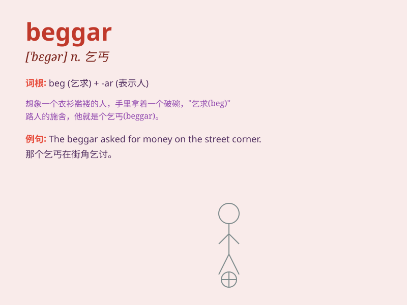

## beggar

**英音:** _[\'begə]_ **美音:** _[\'bɛɡɚ]_

**译义:** *n.乞丐*

### 短语

+ **beggar description:** _非语言所能形容，难以描述_

+ **beggar belief:** _难以置信_

+ **pauper beggar:** _贫民乞丐_

+ **street beggar:** _街头乞丐_

+ **professional beggar:** _职业乞丐_

### 例句

#### 例句1

> **The beggar on the street asked for money.**

**中文翻译:** 街上的乞丐向人要钱。

**单词释义:** 乞丐

#### 例句2

> **His appearance made him look like a beggar.**

**中文翻译:** 他的外表让他看起来就像一个乞丐。

**单词释义:** 乞丐

#### 例句3

> **Don\'t beggar yourself by borrowing too much money.**

**中文翻译:** 不要借太多钱来乞讨自己。

**单词释义:** 使贫穷；使沦为乞丐

### 背诵小故事

> A poor man was always begging on the street. People called him a
beggar. One day, a kind lady gave him some food and money. He was very
grateful. From then on, he decided to change his life and find a job.

**一个可怜的男人总是在街上乞讨。人们称他为乞丐。一天，一位善良的女士给了他一些食物和钱。他非常感激。从那以后，他决定改变自己的生活，找一份工作。**

### 图义

