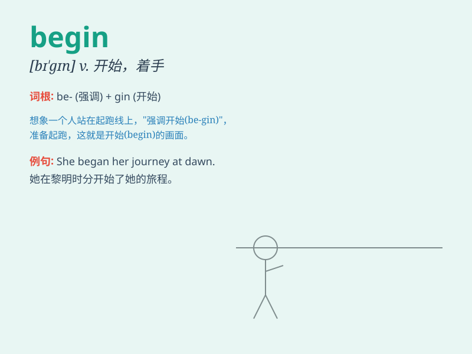

## begin

**英音:** _[bɪ\'gɪn]_ **美音:** _[bɪ\'ɡɪn]_

**译义:** *v.开始,首先*

### 短语

+ **begin with:** _以\...\...开始；从\...\...着手_

+ **begin to do sth:** _开始做某事_

+ **begin doing sth:** _开始做某事_

+ **begin anew:** _重新开始_

+ **begin immediately:** _立即开始_

### 例句

#### 例句1

> **The concert will begin at 8 o\'clock.**

**中文翻译:** 音乐会将于八点开始。

**单词释义:** 开始

#### 例句2

> **She began to cry when she heard the bad news.**

**中文翻译:** 当她听到这个坏消息时，她开始哭泣。

**单词释义:** 开始

#### 例句3

> **Let\'s begin our journey tomorrow.**

**中文翻译:** 让我们开始明天的旅程吧。

**单词释义:** 开始

### 背诵小故事

> One day, Tom was standing in a beautiful garden. The sun was shining
and birds were singing. Then, he decided to BEGIN his adventure to
explore the unknown area of the garden.

**一天，汤姆站在一个美丽的花园里。阳光灿烂，鸟儿在歌唱。然后，他决定开始他的冒险，去探索花园里未知的区域。**

### 图义

