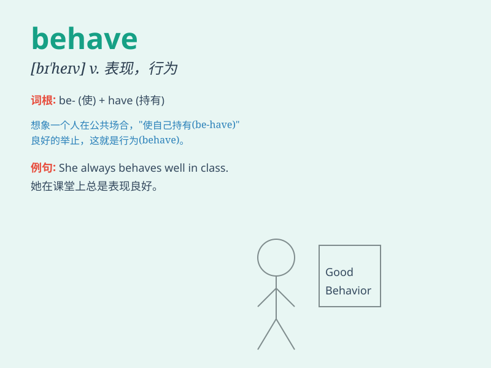

## behave

**英音:** _[bɪ\'heɪv]_ **美音:** _[bɪ\'hev]_

**译义:** *vi.举动,举止,运转v.行为表现*

### 短语

+ **behave oneself:** _举止得体；守规矩_

+ **behave well:** _表现良好；行为端正_

+ **behave badly:** _表现不好；行为恶劣_

+ **behave properly:** _举止恰当；行为合适_

+ **behave strangely:** _行为奇怪；举止怪异_

### 例句

#### 例句1

> **The children behaved well at the party.**

**中文翻译:** 孩子们在聚会上表现得很好。

**单词释义:** 表现

#### 例句2

> **He always behaves politely in public.**

**中文翻译:** 他在公共场合总是表现得彬彬有礼。

**单词释义:** 举止

#### 例句3

> **The dog behaved strangely this morning.**

**中文翻译:** 今天早上这只狗表现得很奇怪。

**单词释义:** 行为

### 背诵小故事

> A little monkey wanted to behave well in the zoo. It didn\'t throw
things or make a mess. Everyone praised it for its good behavior. So,
remember, \'behave\' means to act in a certain way.

**一只小猴子想在动物园里表现良好。它不扔东西也不捣乱。大家都称赞它的良好表现。所以，记住，\'behave\'意思是表现，行为举止。**

### 图义

