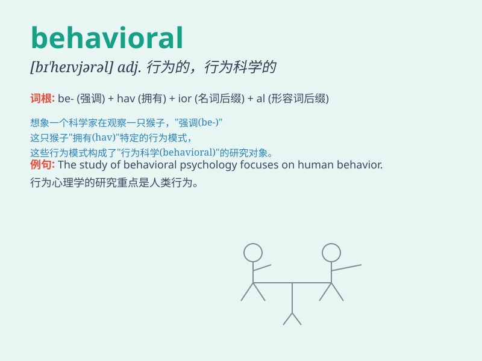

## behavioral

**英音:** _[bɪ\'heɪvjərəl]_ **美音:** _[bɪ\'heɪvjərəl]_

**译义:** *adj.动作的*

### 短语

+ **behavioral disorder:** _行为障碍_

+ **behavioral science:** _行为科学_

+ **behavioral pattern:** _行为模式_

+ **behavioral trait:** _行为特征_

+ **behavioral analysis:** _行为分析_

### 例句

#### 例句1

> **The behavioral patterns of children can often reveal their
personalities.**

**中文翻译:** 孩子的行为模式往往可以揭示他们的性格。

**单词释义:** 行为的；行为方面的

#### 例句2

> **She is studying behavioral economics at the university.**

**中文翻译:** 她正在大学学习行为经济学。

**单词释义:** 行为的

#### 例句3

> **The doctor analyzed the patient\'s behavioral problems.**

**中文翻译:** 医生分析了病人的行为问题。

**单词释义:** 行为方面的

### 背诵小故事

> A monkey showed behavioral changes when it found a new fruit. It
stopped jumping around and started observing carefully. This new
behavior was behavioral. It means relating to the way people or animals
act.

**一只猴子发现一种新水果时表现出了行为上的变化。它不再到处跳，而是开始仔细观察。这种新的表现就是behavioral。它的意思是关于人或动物的行为方式的。**

### 图义

