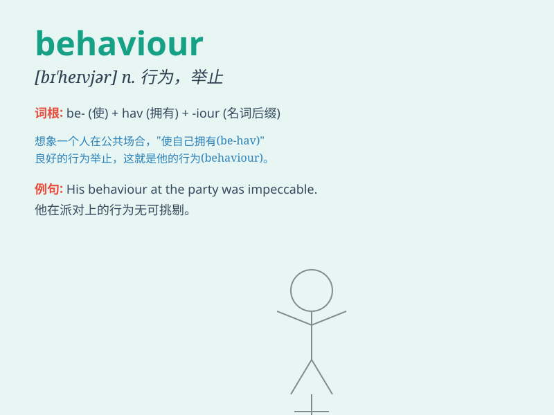

## behaviour

**英音:** _[bɪ\'heɪvjə]_ **美音:** _[bɪ\'hevjər]_

**译义:** *n.行为,举止,习性*

### 短语

+ **behaviour pattern:** _行为模式_

+ **good behaviour:** _良好的行为_

+ **bad behaviour:** _不良行为_

+ **social behaviour:** _社会行为_

+ **animal behaviour:** _动物行为_

### 例句

#### 例句1

> **His behaviour at the party was very polite.**

**中文翻译:** 他在聚会上的举止非常有礼貌。

**单词释义:** 行为；举止

#### 例句2

> **The child\'s bad behaviour made his parents angry.**

**中文翻译:** 孩子的不良行为使他的父母很生气。

**单词释义:** 行为；举止

#### 例句3

> **The study examines the behaviour of animals in their natural
habitat.**

**中文翻译:** 该研究考察了动物在自然栖息地的行为。

**单词释义:** 行为；表现

### 背诵小故事

> One day, Tom was in the park. A little dog\'s behaviour attracted
him. The dog was friendly, running and playing. Tom realized that
behaviour means the way someone or something acts.

**有一天，汤姆在公园。一只小狗的行为吸引了他。这只狗很友好，跑着玩着。汤姆意识到
behaviour 这个单词意思是某人或某物的行为方式。**

### 图义

