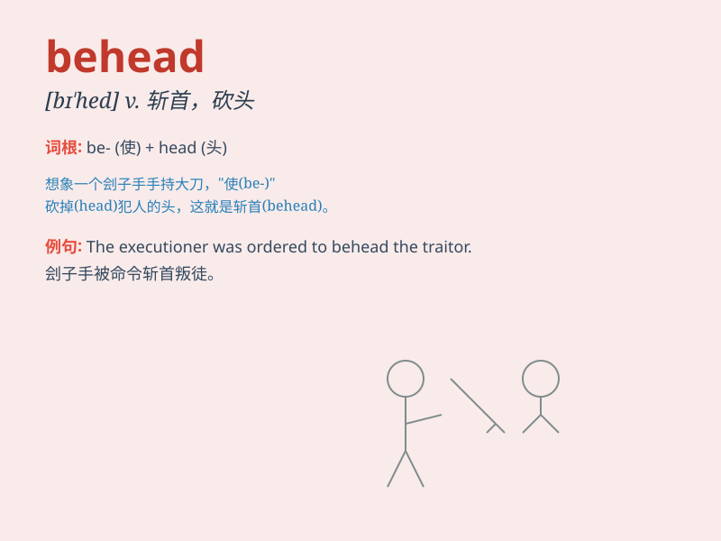

## behead

**英音:** _[bɪ\'hed]_ **美音:** _[bɪ\'hɛd]_

**译义:** *vt.斩首,砍头,[地质](指海盗河pirale
stream)使其他河川的水流入自己河中*

### 短语

+ **behead someone:** _将某人斩首_

+ **behead publicly:** _公开斩首_

+ **behead illegally:** _非法斩首_

+ **behead brutally:** _残忍地斩首_

+ **behead unjustly:** _不公正地斩首_

### 例句

#### 例句1

> **The king ordered to behead the traitor.**

**中文翻译:** 国王下令将叛徒斩首。

**单词释义:** 斩首；砍头

#### 例句2

> **In the old days, criminals were often beheaded for serious
crimes.**

**中文翻译:** 在过去，罪犯经常因犯下严重罪行而被斩首。

**单词释义:** 砍头；斩首

#### 例句3

> **The rebel leader threatened to behead the hostages if their
demands were not met.**

**中文翻译:** 叛军领导人威胁称，如果不满足人质的要求，他们将被斩首。

**单词释义:** 斩首；杀头

### 背诵小故事

> Once upon a time, in a cruel kingdom, the evil king ordered to behead
anyone who opposed him. \'Behead\' means to cut off someone\'s head, a
terrifying act. Poor citizens lived in fear.

**从前，在一个残酷的王国，邪恶的国王下令砍任何反对他的人的头。'behead'意思是砍掉某人的头，一种可怕的行为。可怜的民众生活在恐惧中。**

### 图义

