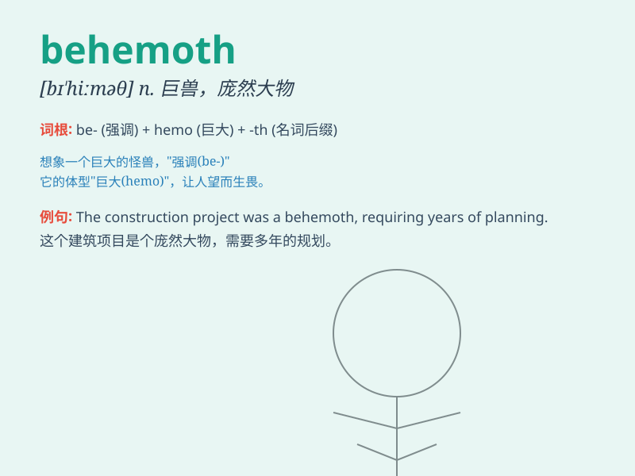

## behemoth

**英音:** _[bɪ\'hiːmɒθ; \'biːhɪ,məʊθ]_ **美音:**
_[bɪ\'himɔθ]_

**译义:** *n.[圣经]河马,巨兽,庞然大物*

### 短语

+ **industrial behemoth:** _工业巨头_

+ **corporate behemoth:** _公司巨头_

+ **financial behemoth:** _金融巨头_

+ **retail behemoth:** _零售巨头_

+ **media behemoth:** _媒体巨头_

### 例句

#### 例句1

> **The new shopping mall is a behemoth, attracting thousands of
shoppers every day.**

**中文翻译:**
新的购物中心是一个庞然大物，每天吸引着成千上万的购物者。

**单词释义:** 巨大的事物；庞然大物

#### 例句2

> **The tech company has become a behemoth in the industry,
dominating the market.**

**中文翻译:** 这家科技公司已成为行业巨头，主导市场。

**单词释义:** 巨头；强大的组织

#### 例句3

> **The behemoth of a ship sailed smoothly across the ocean.**

**中文翻译:** 一艘庞然大物，平稳地驶过大海。

**单词释义:** 巨大的东西

### 背诵小故事

> A long time ago, in a deep forest, there was a huge monster called
Behemoth. It was so big that it could shake the ground when it walked.
Everyone was scared of it. Remember this monster to remember the word
\'behemoth\' meaning a huge and powerful thing.

**很久以前，在一片幽深的森林里，有一只巨大的怪兽叫贝希摩斯。它体型巨大，行走时能震动大地。所有人都害怕它。记住这只怪兽就能记住'behemoth'这个表示巨大而强有力的事物的单词。**

### 图义

