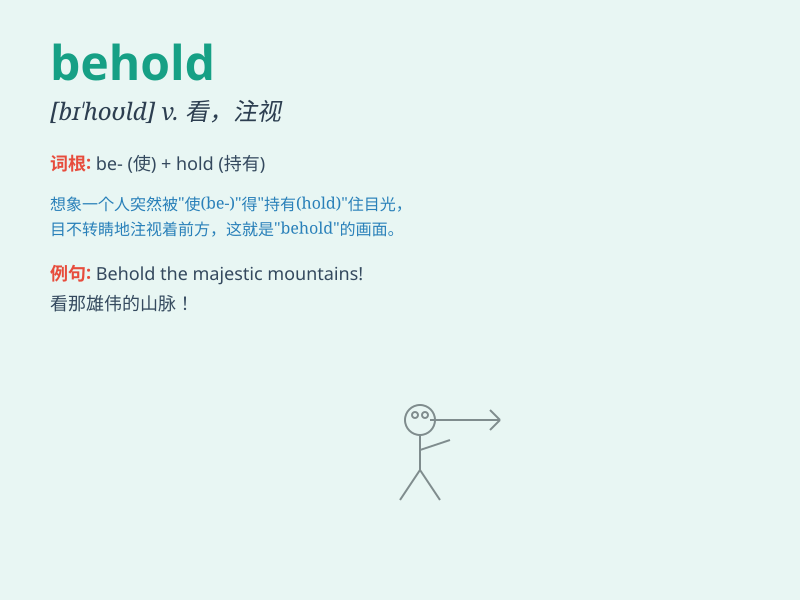

## behold

**英音:** _[bɪ\'həʊld]_ **美音:** _[bɪ\'hold]_

**译义:** *vt.把\...视为vi.看*

### 短语

+ **behold the beauty:** _观赏美景_

+ **behold with wonder:** _惊奇地注视_

+ **behold in astonishment:** _惊愕地看着_

+ **behold solemnly:** _庄严地注视_

+ **behold affectionately:** _深情地看着_

### 例句

#### 例句1

> **Behold the beautiful sunset!**

**中文翻译:** 看美丽的日落！

**单词释义:** 看，注视

#### 例句2

> **They beheld a strange sight.**

**中文翻译:** 他们看到了奇怪的景象。

**单词释义:** 看到，目睹

#### 例句3

> **Behold, this is the key to the problem.**

**中文翻译:** 瞧，这就是问题的关键。

**单词释义:** 看，瞧

### 背诵小故事

> A brave knight was on a quest. When he reached the top of a mountain,
he shouted \'Behold! The beautiful kingdom lies before us!\' meaning
\'Look!\'. It helped him remember the word \'behold\' as a command to
direct attention.

**一位勇敢的骑士正在探险。当他到达山顶时，他大喊'看啊！美丽的王国就在我们面前！'这里的'behold'意思就是'看'。这帮助他记住'behold'这个单词是让人注意看的意思。**

### 图义

