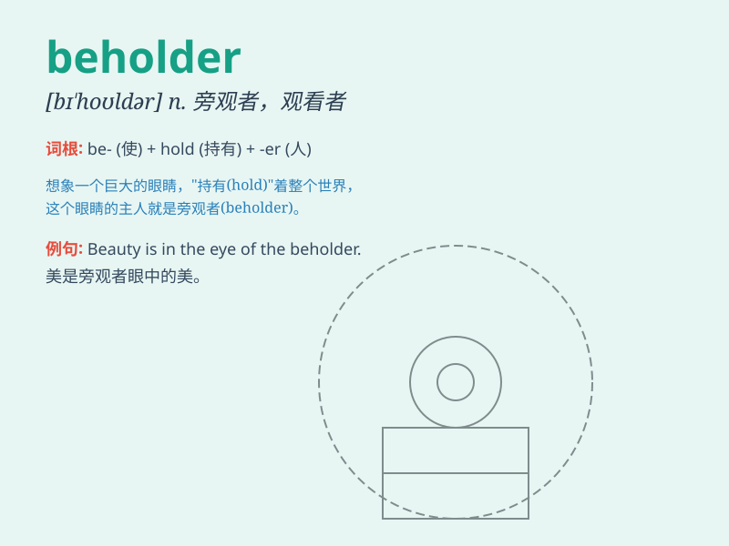

## beholder

**英音:** _[bɪ\'həʊldə]_ **美音:** _[bɪ\'holdɚ]_

**译义:** *n.目睹者,旁观者*

### 短语

+ **keen beholder:** _敏锐的观察者_

+ **curious beholder:** _好奇的旁观者_

+ **passive beholder:** _被动的观看者_

+ **attentive beholder:** _专注的观察者_

+ **discerning beholder:** _有洞察力的旁观者_

### 例句

#### 例句1

> **The beholder was amazed by the beautiful scenery.**

**中文翻译:** 观赏者被这美丽的景色所惊叹。

**单词释义:** 旁观者

#### 例句2

> **In the art exhibition, the beholders praised the painter\'s
works.**

**中文翻译:** 画展上，观众对画家的作品赞不绝口。

**单词释义:** 旁观者

#### 例句3

> **The beholder witnessed the accident but was unable to help.**

**中文翻译:** 旁观者目睹了事故，但无法提供帮助。

**单词释义:** 旁观者

### 背诵小故事

> A thief was stealing in a dark alley. Suddenly, a beholder appeared
and witnessed everything. The thief was caught because of this observer.
Remember, a beholder is someone who watches or observes.

**一个小偷正在黑暗的小巷里偷东西。突然，一个旁观者出现并目睹了一切。小偷因为这个观察者被抓住了。记住，beholder
就是观看者或观察者。**

### 图义

