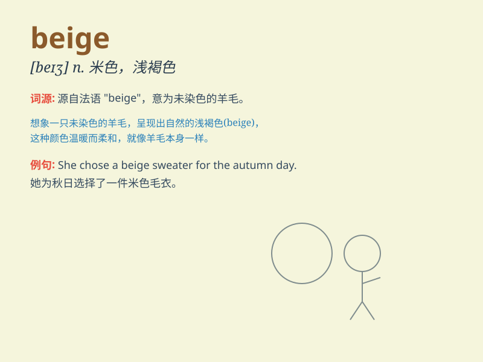

## beige

**英音:** _[beɪʒ; beɪdʒ]_ **美音:** _[beʒ]_

**译义:** *adj.浅褐色的n.米色*

### 短语

+ **beige carpet:** _米色地毯_

+ **beige dress:** _米色连衣裙_

+ **beige jacket:** _米色夹克_

+ **beige sofa:** _米色沙发_

+ **beige wallpaper:** _米色壁纸_

### 例句

#### 例句1

> **She wore a beige dress to the party.**

**中文翻译:** 她穿着一件米色连衣裙去参加聚会。

**单词释义:** 米色的；浅褐色的（指裙子的颜色）

#### 例句2

> **The walls were painted in a soft beige color.**

**中文翻译:** 墙壁被漆成柔和的米色。

**单词释义:** 米色；浅褐色（指墙壁的颜色）

#### 例句3

> **He chose a beige sofa for his living room.**

**中文翻译:** 他为客厅选择了一张米色沙发。

**单词释义:** 米色的（指沙发的颜色）

### 背诵小故事

> A little mouse was looking for a new home. It finally found a cave
with beige walls. The color made it feel warm and safe. From then on,
the mouse lived happily in this beige cave.

**一只小老鼠正在寻找一个新家。它最终找到了一个有着米色墙壁的洞穴。这个颜色让它感到温暖和安全。从此，小老鼠快乐地住在这个米色的洞穴里。**

### 图义

