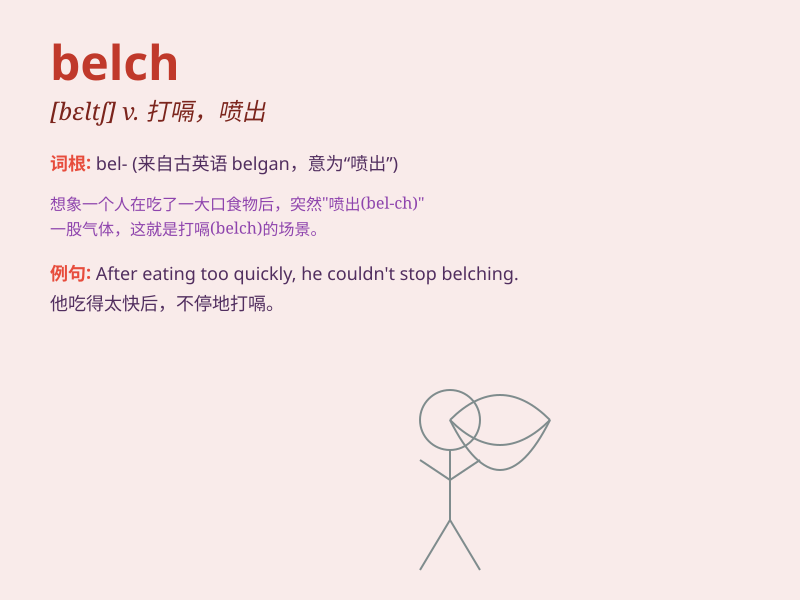

## belch

**英音:** _[beltʃ]_ **美音:** _[bɛltʃ]_

**译义:** *v.打嗝,(火山、炮等)冒烟、喷出n.打嗝,喷射*

### 短语

+ **belch forth:** _喷出；吐出_

+ **belch smoke:** _冒烟_

+ **belch out:** _大声说出；爆发_

+ **belch fire:** _喷火_

+ **belch fumes:** _排出烟雾_

### 例句

#### 例句1

> **The volcano belched out smoke and lava.**

**中文翻译:** 火山喷出烟雾和熔岩。

**单词释义:** 喷出

#### 例句2

> **He belched loudly after the meal.**

**中文翻译:** 饭后他打嗝得很厉害。

**单词释义:** 打嗝

#### 例句3

> **The factory belches smoke into the air every day.**

**中文翻译:** 该工厂每天都会向空气中排放烟雾。

**单词释义:** 排放

### 背诵小故事

> One day, Tom ate too much and felt very uncomfortable. Suddenly, he
belched loudly, which made everyone around him look at him strangely.
Poor Tom was so embarrassed.

**有一天，汤姆吃得太多，感觉非常不舒服。突然，他大声地打嗝，这让周围的每个人都奇怪地看着他。可怜的汤姆感到非常尴尬。**

### 图义

