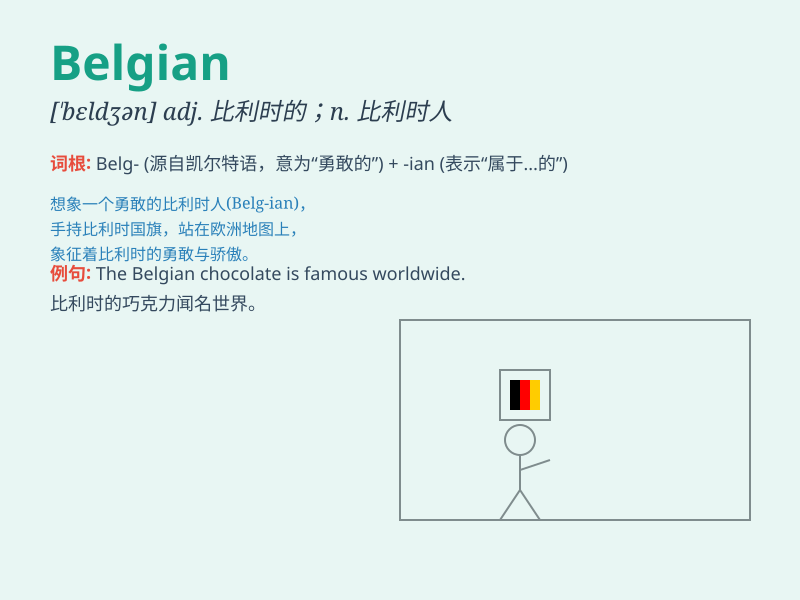

## Belgian

**英音:** _[ˈbɛldʒən]_ **美音:** _[ˈbɛldʒən]_

**译义:** *adj.比利时的；比利时人的 n.比利时人*

### 短语

+ **Belgian chocolate:** _比利时巧克力_

+ **Belgian waffle:** _比利时华夫饼_

+ **Belgian fries:** _比利时薯条_

+ **Belgian beer:** _比利时啤酒_

+ **Belgian lace:** _比利时花边_

### 例句

#### 例句1

> **The Belgian chocolate is famous worldwide.**

**中文翻译:** 比利时巧克力举世闻名。

**单词释义:** 比利时的；比利时人的

#### 例句2

> **She married a Belgian man.**

**中文翻译:** 她嫁给了一个比利时男人。

**单词释义:** 比利时的；比利时人的

#### 例句3

> **The Belgian team performed well in the tournament.**

**中文翻译:** 比利时队在锦标赛中表现出色。

**单词释义:** 比利时的；比利时人的

### 背诵小故事

> A Belgian traveler was lost in a strange city. He asked for
directions and finally found his way with the help of friendly locals.
The Belgian was so grateful for their kindness.

**一位比利时旅行者在一个陌生的城市迷路了。他问路，最后在友好的当地人的帮助下找到了路。这位比利时人非常感激他们的友善。**

### 图义

