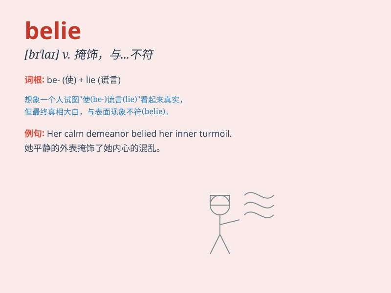

## belie

**英音:** _[bɪ\'laɪ]_ **美音:** _[bɪ\'laɪ]_

**译义:** *v.掩饰*

### 短语

+ **belie one\'s age:** _看上去比实际年龄年轻_

+ **belie the fact:** _掩盖事实_

+ **belie one\'s appearance:** _与外表不符_

+ **belie one\'s words:** _与某人的话不符_

+ **belie expectations:** _辜负期望_

### 例句

#### 例句1

> **His cheerful appearance belies his inner sadness.**

**中文翻译:** 他开朗的外表掩盖了他内心的悲伤。

**单词释义:** 掩盖；掩饰

#### 例句2

> **The calm waters belied the danger beneath.**

**中文翻译:** 平静的水面掩盖了下面的危险。

**单词释义:** 给人以错觉；掩饰

#### 例句3

> **Her actions belied her words.**

**中文翻译:** 她的行动与她的话不符。

**单词释义:** 与...不符；证明...为假

### 背诵小故事

> A brave knight was always described as weak by his enemies, but his
actions belied those false claims. He proved his strength in battles and
showed that the lies were just attempts to deceive.

**一位勇敢的骑士总是被敌人描述为弱小，但他的行动证明了那些说法是错误的。他在战斗中证明了自己的强大，表明那些谎言只是试图欺骗。**

### 图义

