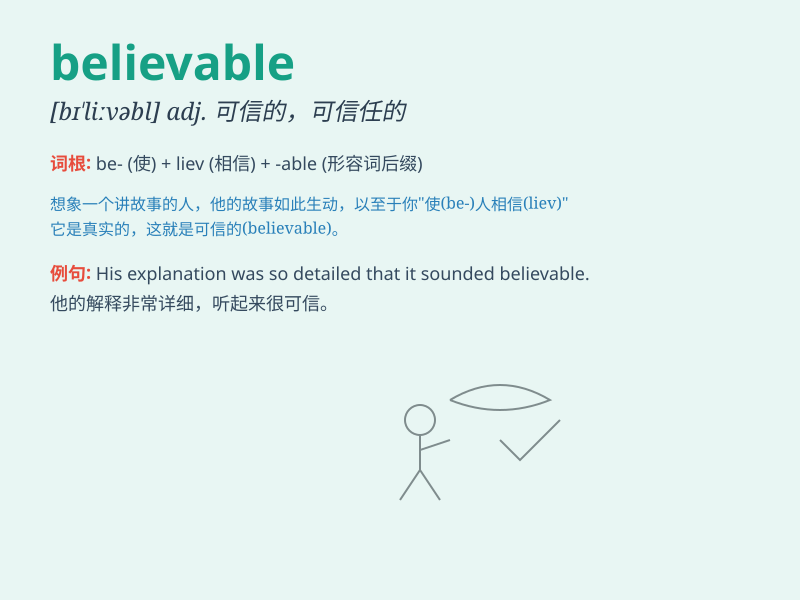

## believable

**英音:** _[bɪˈliːvəbl]_ **美音:** _[bɪˈliːvəbl]_

**译义:** *adj.可信的*

### 短语

+ **seem believable:** _看起来可信_

+ **hardly believable:** _几乎不可信_

+ **quite believable:** _相当可信_

+ **totally believable:** _完全可信_

+ **eminently believable:** _极其可信_

### 例句

#### 例句1

> **The story he told was quite believable.**

**中文翻译:** 他讲的故事非常可信。

**单词释义:** 可信的

#### 例句2

> **Her excuse seemed believable at first, but later I realized it
was a lie.**

**中文翻译:** 她的借口一开始似乎可信，但后来我意识到这是一个谎言。

**单词释义:** 可信的

#### 例句3

> **It\'s not believable that he could finish the work in such a
short time.**

**中文翻译:** 令人难以置信的是他能在这么短的时间内完成这项工作。

**单词释义:** 可信的

### 背诵小故事

> One day, a little boy told a story. Everyone thought it was so wild
and impossible. But then he showed clear evidence, and suddenly his
story became believable. People started to believe him.

**有一天，一个小男孩讲了一个故事。大家都觉得太离谱太不可能了。但后来他拿出了清晰的证据，突然他的故事就变得可信了。人们开始相信他。**

### 图义

