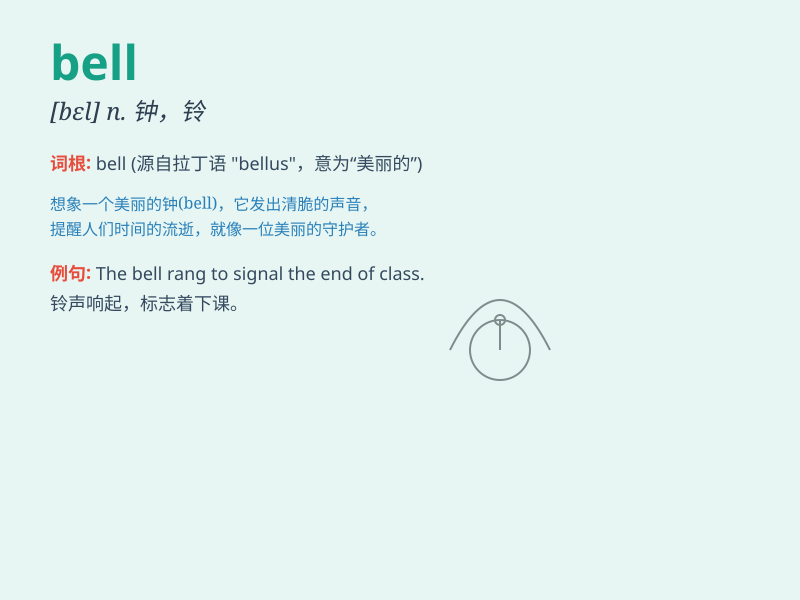

## bell

**英音:** _[bel]_ **美音:** _[bɛl]_

**译义:** *n.铃,钟*

### 短语

+ **ring a bell:** _听起来耳熟_

+ **alarm bell:** _警钟；警报_

+ **bell tower:** _钟楼_

+ **bell bottom:** _喇叭裤_

+ **jingle bell:** _铃铛；门铃_

### 例句

#### 例句1

> **The church bell rang loudly.**

**中文翻译:** 教堂的钟大声地响了。

**单词释义:** 钟

#### 例句2

> **She heard the doorbell ring.**

**中文翻译:** 她听到门铃响了。

**单词释义:** 门铃

#### 例句3

> **The alarm bell went off, waking everyone up.**

**中文翻译:** 警报铃响了，把每个人都吵醒了。

**单词释义:** 铃

### 背诵小故事

> A little mouse was playing in the house. Suddenly, it heard the bell
ring loudly. It was so scared that it hid quickly. The bell\'s sound
meant someone was coming to the door.

**一只小老鼠正在房子里玩耍。突然，它听到铃声响亮地响起。它非常害怕，迅速躲了起来。铃声意味着有人来到了门口。**

### 图义

