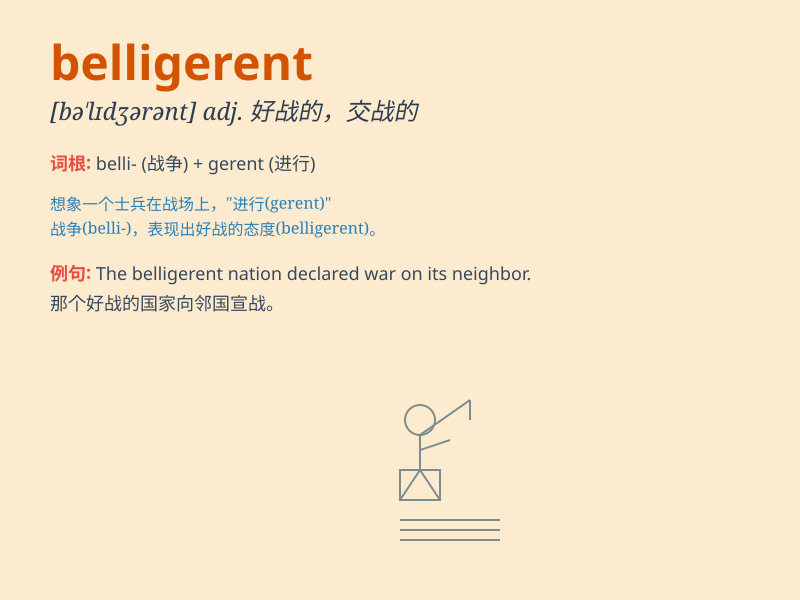

## belligerent

**英音:** _[bəˈlɪdʒərənt]_ **美音:** _[bəˈlɪdʒərənt]_

**译义:** *adj.好战的,交战国的,交战的*

### 短语

+ **belligerent attitude:** _好战的态度_

+ **belligerent nation:** _好战的国家_

+ **belligerent behavior:** _好斗的行为_

+ **become belligerent:** _变得好战_

+ **remain belligerent:** _保持好战_

### 例句

#### 例句1

> **The belligerent nation launched a surprise attack on its
neighbor.**

**中文翻译:** 好战的国家对其邻国发动了突然袭击。

**单词释义:** 好战的

#### 例句2

> **He became belligerent when he was drunk.**

**中文翻译:** 他喝醉时变得好斗。

**单词释义:** 好斗的

#### 例句3

> **The belligerent attitude of the team led to their defeat.**

**中文翻译:** 这个团队的好战态度导致了他们的失败。

**单词释义:** 好战的

### 背诵小故事

> In a war-torn land, a fierce warrior was always ready to fight. He
was belligerent, constantly seeking battles. His aggressive attitude
made others afraid. But in the end, his belligerence brought only more
chaos and destruction.

**在一个饱受战争蹂躏的土地上，有一个凶猛的战士总是准备战斗。他好斗，不断寻求战斗。他咄咄逼人的态度让其他人感到害怕。但最后，他的好战只带来了更多的混乱和破坏。**

### 图义

