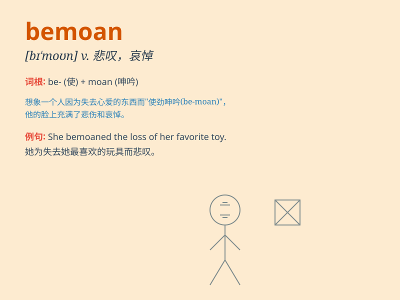

## bemoan

**英音:** _[bɪ\'məʊn]_ **美音:** _[bɪ\'mon]_

**译义:** *vt.哀叹*

### 短语

+ **bemoan one\'s fate:** _哀叹某人的命运_

+ **bemoan the loss:** _悲叹损失_

+ **bemoan one\'s misfortune:** _为某人的不幸而哀怨_

+ **bemoan the state of affairs:** _抱怨事态_

+ **bemoan one\'s bad luck:** _哀叹自己的厄运_

### 例句

#### 例句1

> **He constantly bemoans his lack of opportunities.**

**中文翻译:** 他不断地抱怨自己缺乏机会。

**单词释义:** 哀叹；悲叹

#### 例句2

> **The old woman bemoaned the loss of her youth.**

**中文翻译:** 老妇人为失去青春而哀叹。

**单词释义:** 为\...\...感到遗憾；抱怨

#### 例句3

> **She bemoaned the state of the education system.**

**中文翻译:** 她对教育系统的现状表示遗憾。

**单词释义:** 埋怨；诉苦

### 背诵小故事

> A poor man bemoaned his fate. He lost his job and had no money. But
then he found a way to change and stopped bemoaning. He worked hard and
his life got better.

**一个可怜的人哀叹他的命运。他丢了工作，没有钱。但后来他找到了改变的方法，不再哀叹。他努力工作，生活变得更好了。**

### 图义

