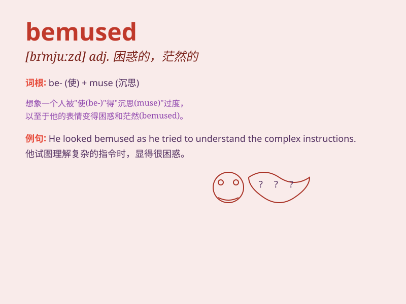

## bemused

**英音:** _[bɪ\'mjuːzd]_ **美音:** _[bɪ\'mjuzd]_

**译义:** *adj.困惑的,发呆的*

### 短语

+ **be bemused by:** _被\...\...弄得迷惑_

+ **bemused expression:** _困惑的表情_

+ **bemused look:** _困惑的神情_

+ **remain bemused:** _仍然感到困惑_

+ **seem bemused:** _看起来困惑_

### 例句

#### 例句1

> **He looked bemused by all the questions.**

**中文翻译:** 他看上去对所有的问题感到困惑。

**单词释义:** 困惑的；茫然的

#### 例句2

> **She had a bemused expression on her face.**

**中文翻译:** 她脸上露出困惑的表情。

**单词释义:** 困惑的；茫然的

#### 例句3

> **The audience appeared bemused by the strange performance.**

**中文翻译:** 观众们似乎对这种奇怪的表演感到困惑。

**单词释义:** 困惑的；茫然的

### 背诵小故事

> A tourist was bemused when he got lost in a strange town. He
couldn\'t understand the local language and the signs were confusing.
But finally, with the help of a kind local, he found his way.

**一位游客在一个陌生的城镇迷路时感到困惑。他不懂当地语言，标识也令人迷惑。但最后，在一位好心当地人的帮助下，他找到了路。**

### 图义

