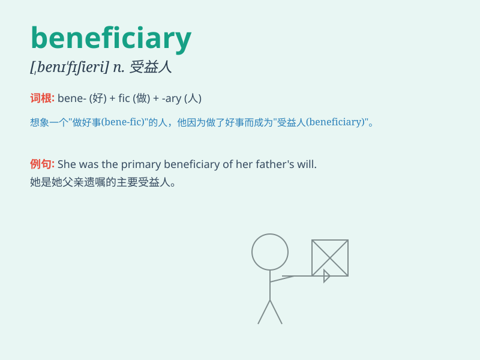

## beneficiary

**英音:** _[benɪ\'fɪʃ(ə)rɪ]_ **美音:**
_[,bɛnɪ\'fɪʃɪɛri]_

**译义:** *n.受惠者,受益人*

### 短语

+ **beneficiary country:** _受益国_

+ **primary beneficiary:** _首要受益人_

+ **ultimate beneficiary:** _最终受益人_

+ **beneficiary certificate:** _受益凭证_

+ **trust beneficiary:** _信托受益人_

### 例句

#### 例句1

> **The beneficiary of the will was his daughter.**

**中文翻译:** 遗嘱的受益人是他的女儿。

**单词释义:** 受益人

#### 例句2

> **The insurance policy named her as the primary beneficiary.**

**中文翻译:** 保险单将她列为主要受益人。

**单词释义:** 受益人

#### 例句3

> **He was the sole beneficiary of the trust fund.**

**中文翻译:** 他是该信托基金的唯一受益人。

**单词释义:** 受益人

### 背诵小故事

> A poor man was struggling until one day he received a letter saying
he was the beneficiary of a large inheritance. The money changed his
life. Remember, a beneficiary is one who benefits or gains from
something.

**一个穷人一直在苦苦挣扎，直到有一天他收到一封信，说他是一大笔遗产的受益人。这笔钱改变了他的生活。记住，beneficiary
就是受益或从某事中获利的人。**

### 图义

