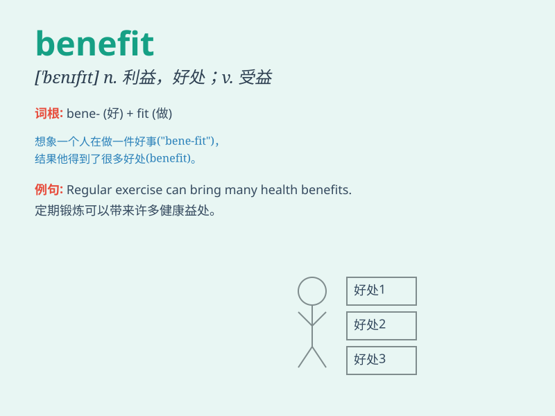

## benefit

**英音:** _[\'benɪfɪt]_ **美音:** _[\'bɛnɪfɪt]_

**译义:** *n.利益,好处vt.有益于,有助于vi.受益*

### 短语

+ **benefit from:** _从\...\...中受益_

+ **social benefit:** _社会效益_

+ **economic benefit:** _经济效益_

+ **mutual benefit:** _互惠互利_

+ **for the benefit of:** _为了\...\...的利益_

### 例句

#### 例句1

> **The new policy will bring great benefits to the public.**

**中文翻译:** 新政策将为民众带来巨大实惠。

**单词释义:** 好处；利益

#### 例句2

> **She has benefited from regular exercise.**

**中文翻译:** 她从定期锻炼中受益。

**单词释义:** 受益；得益于

#### 例句3

> **The company\'s employees receive a number of benefits, including
health insurance and paid vacation.**

**中文翻译:** 公司的员工享有多项福利，包括健康保险和带薪休假。

**单词释义:** 福利；津贴

### 背诵小故事

> A poor student was struggling. But with a scholarship, he could buy
better books and study tools. The scholarship was a benefit that changed
his life and helped him succeed.

**一个贫困的学生正在苦苦挣扎。但有了奖学金，他能够买更好的书籍和学习工具。奖学金就是一项福利，改变了他的生活，帮助他取得成功。**

### 图义

