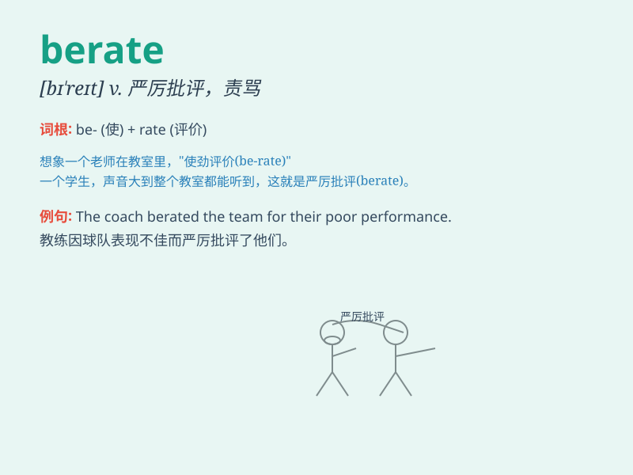

## berate

**英音:** _[bɪ\'reɪt]_ **美音:** _[bɪ\'ret]_

**译义:** *vt.严厉指责,申斥*

### 短语

+ **berate oneself:** _自责；自我谴责_

+ **berate someone for something:** _因某事斥责某人_

+ **berate angrily:** _愤怒地斥责_

+ **berate harshly:** _严厉地责骂_

+ **berate publicly:** _公开指责_

### 例句

#### 例句1

> **The boss berated the employee for making a serious mistake.**

**中文翻译:** 老板斥责员工犯了一个严重的错误。

**单词释义:** 斥责

#### 例句2

> **She berated herself for not being more careful.**

**中文翻译:** 她责备自己不够小心。

**单词释义:** 责备

#### 例句3

> **The coach berated the team for their poor performance.**

**中文翻译:** 教练因球队表现不佳而训斥了他们。

**单词释义:** 训斥

### 背诵小故事

> A boss was always berating his employees. One day, a brave employee
stood up and said, \'Stop berating us! We are doing our best.\' The boss
was shocked and realized his mistake. Berate means scold or criticize
harshly.

**一位老板总是斥责他的员工。有一天，一位勇敢的员工站起来说：'别再斥责我们了！我们已经尽力了。'老板震惊了并意识到自己的错误。berate
意思是严厉斥责或批评。**

### 图义

