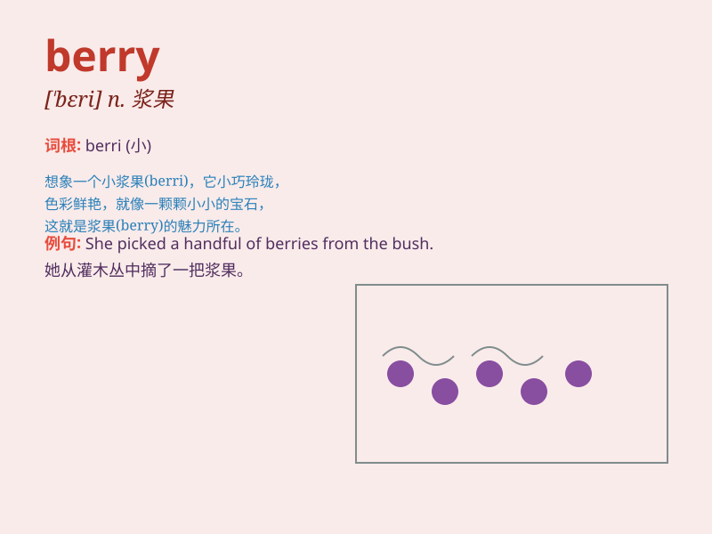

## berry

**英音:** _[\'berɪ]_ **美音:** _[\'bɛri]_

**译义:** *n.浆果*

### 短语

+ **strawberry:** _草莓_

+ **blueberry:** _蓝莓_

+ **blackberry:** _黑莓_

+ **raspberry:** _覆盆子_

+ **gooseberry:** _醋栗_

### 例句

#### 例句1

> **I picked some fresh berries from the bush.**

**中文翻译:** 我从灌木丛中摘了一些新鲜的浆果。

**单词释义:** 浆果

#### 例句2

> **The strawberry is a popular berry.**

**中文翻译:** 草莓是一种受欢迎的浆果。

**单词释义:** 浆果

#### 例句3

> **She made a pie with mixed berries.**

**中文翻译:** 她用混合浆果做了一个馅饼。

**单词释义:** 浆果

### 背诵小故事

> One sunny day, a little bear went into the forest and found many
colorful berries. They were so sweet and juicy. The bear ate them
happily and remembered the name \'berry\' for these delicious fruits.

**在一个阳光明媚的日子，一只小熊走进森林，发现了许多五颜六色的浆果。它们又甜又多汁。小熊开心地吃着，并记住了"berry"这个表示这些美味水果的名字。**

### 图义

