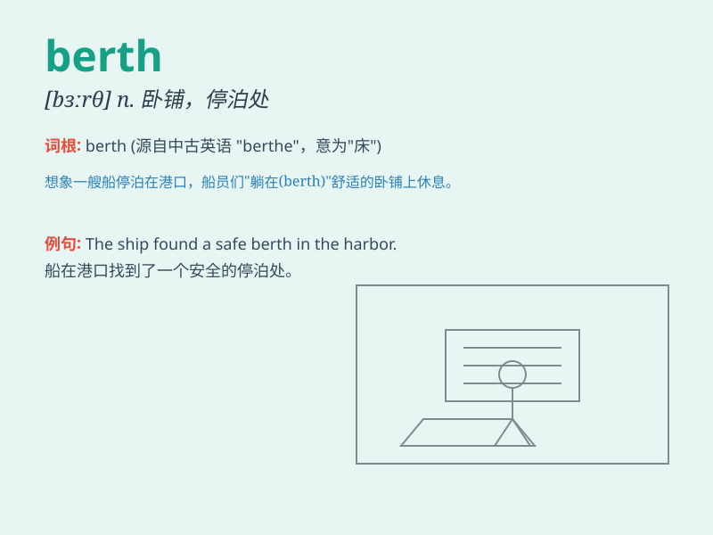

## berth

**英音:** _[bɜːθ]_ **美音:** _[bɝθ]_

**译义:** *n.停泊处,卧铺(口语)职业v.使停泊*

### 短语

+ **give someone/something a wide berth:** _刻意避开某人/某物_

+ **take up a berth:** _占用一个泊位_

+ **find a berth:** _找到一个泊位_

+ **berth ticket:** _卧铺票_

+ **berth allocation:** _泊位分配_

### 例句

#### 例句1

> **The ship berthed at the port.**

**中文翻译:** 这艘船在港口停泊。

**单词释义:** （使船）停泊

#### 例句2

> **He reserved a berth on the train.**

**中文翻译:** 他预订了火车上的一个卧铺。

**单词释义:** 卧铺

#### 例句3

> **The truck driver found a berth to park his vehicle.**

**中文翻译:** 卡车司机找到了一个停车的泊位。

**单词释义:** 泊位

### 背诵小故事

> A sailor was always worried about finding a good berth on the ship.
One day, he finally got a comfortable berth and had a peaceful journey.
Now when he thinks of \'berth\', he remembers that happy moment.

**一位水手总是担心在船上找不到好的泊位。有一天，他终于得到了一个舒适的泊位，并拥有了一次平静的旅程。现在当他想到\'berth\'这个词时，就会想起那个快乐的时刻。**

### 图义

