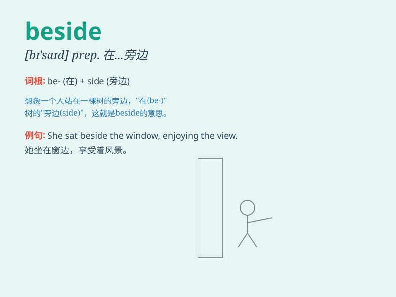

## beside

**英音:** _[bɪ\'saɪd]_ **美音:** _[bɪ\'saɪd]_

**译义:** * prep.在旁边,和\...比较*

### 短语

+ **beside oneself:** _极度兴奋；发狂_

+ **beside the point:** _离题；不相关_

+ **stand beside:** _站在旁边_

+ **sit beside:** _坐在旁边_

+ **lie beside:** _躺在旁边_

### 例句

#### 例句1

> **He sat beside her at the concert.**

**中文翻译:** 他在音乐会上坐在她旁边。

**单词释义:** 在\...\...旁边

#### 例句2

> **The dog lay beside the fire to keep warm.**

**中文翻译:** 狗躺在炉火旁取暖。

**单词释义:** 在\...\...旁边

#### 例句3

> **Beside his achievements, his faults are insignificant.**

**中文翻译:** 与他的成就相比，他的缺点微不足道。

**单词释义:** 与\...\...相比

### 背诵小故事

> One day, Tom was sitting beside the river. A beautiful butterfly
landed beside him. He was so happy. Beside means at the side of
something or someone.

**一天，汤姆正坐在河边。一只漂亮的蝴蝶落在他旁边。他非常开心。Beside
意思是在某物或某人的旁边。**

### 图义

