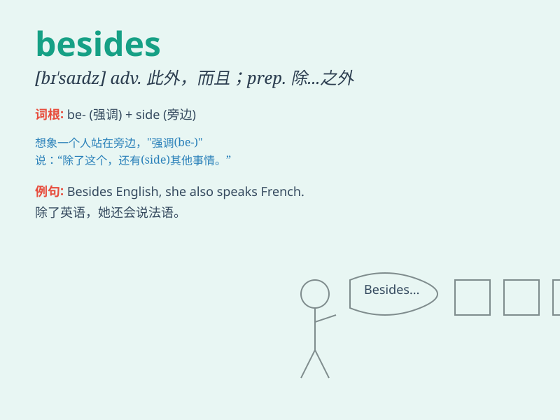

## besides

**英音:** _[bɪ\'saɪdz]_ **美音:** _[bɪ\'saɪdz]_

**译义:** *adv.此外 prep.除\...之外*

### 短语

+ **besides oneself:** _极度兴奋；发狂_

+ **besides the point:** _离题；不相干_

+ **quite besides:** _简直离题_

+ **besides the mark:** _不相关；不恰当_

+ **besides the question:** _离题；与本题无关_

### 例句

#### 例句1

> **Besides English, I also study French.**

**中文翻译:** 除了英语，我还学习法语。

**单词释义:** 除......之外（还有）

#### 例句2

> **There was no one there besides the teacher.**

**中文翻译:** 那里除了老师没有别人。

**单词释义:** 除......之外（还有）

#### 例句3

> **Besides, I have a lot of work to do.**

**中文翻译:** 此外，我有很多工作要做。

**单词释义:** 此外；而且

### 背诵小故事

> One day, Tom was at a party. Besides having fun, he also met many new
friends. He enjoyed the food and music. Besides, he got some great ideas
for his project.

**一天，汤姆在一个派对上。除了玩得开心，他还结识了很多新朋友。他享受着食物和音乐。此外，他还为自己的项目获得了一些很棒的想法。**

### 图义

