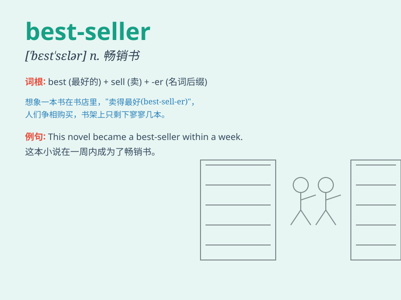

## best-seller

**英音:** _[ˌbest ˈselə]_ **美音:** _[ˌbɛst ˈsɛlər]_

**译义:** *n. 畅销书；畅销产品；畅销货*

### 短语

+ **best-seller list:** _畅销书排行榜_

+ **become a best-seller:** _成为畅销书_

+ **best-seller author:** _畅销书作者_

+ **international best-seller:** _国际畅销书_

+ **best-seller novel:** _畅销小说_

### 例句

#### 例句1

> **This novel has become a best-seller.**

**中文翻译:** 这本小说已经成为了畅销书。

**单词释义:** 畅销书

#### 例句2

> **The author\'s latest book is a best-seller in many countries.**

**中文翻译:** 这位作者的最新著作在许多国家都是畅销书。

**单词释义:** 畅销书

#### 例句3

> **Her cookbook was a surprise best-seller.**

**中文翻译:** 她的烹饪书出人意料地成为了畅销书。

**单词释义:** 畅销书

### 背诵小故事

> A young author worked hard day and night. Finally, her book became a
best-seller. Everyone loved it and couldn\'t put it down. It was the
best among all the books sold.

**一位年轻的作者日夜努力工作。最终，她的书成为了畅销书。每个人都喜欢它，爱不释手。这是所有售出的书中最好的。**

### 图义

