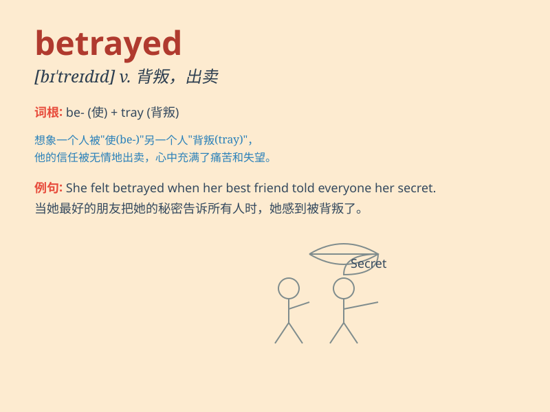

## betrayed

**英音:** _[bɪˈtreɪd]_ **美音:** _[bɪˈtreɪd]_

**译义:** *v. 出卖；背叛；泄露（秘密）；露出...迹象*

### 短语

+ **betrayed trust:** _背叛信任_

+ **betrayed secret:** _泄露秘密_

+ **betrayed friend:** _背叛朋友_

+ **betrayed emotion:** _流露情感_

+ **betrayed intention:** _暴露意图_

### 例句

#### 例句1

> **He betrayed his country to the enemy.**

**中文翻译:** 他向敌人出卖了他的国家。

**单词释义:** 出卖；背叛

#### 例句2

> **Her expression betrayed her fear.**

**中文翻译:** 她的表情暴露了她的恐惧。

**单词释义:** 暴露；显露

#### 例句3

> **The tone of his voice betrayed his anger.**

**中文翻译:** 他说话的语气显露出他的愤怒。

**单词释义:** 显露出；表现出

### 背诵小故事

> A spy was sent to the enemy camp. But his heart was always with his
own country. However, his partner betrayed him and revealed his true
identity. The spy was in great danger.

**一名间谍被派往敌营。但他的心始终向着自己的国家。然而，他的搭档背叛了他，暴露了他的真实身份。这名间谍陷入了极大的危险之中。**

### 图义

