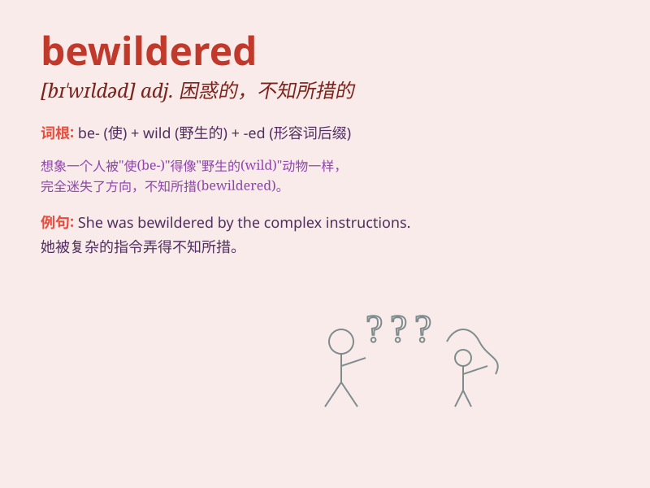

## bewildered

**英音:** _[bɪˈwɪldəd]_ **美音:** _[bɪˈwɪldərd]_

**译义:** *adj. 困惑的，不知所措的；被迷惑的*

### 短语

+ **be bewildered at:** _对\...\...感到困惑_

+ **be bewildered by:** _被\...\...弄得不知所措_

+ **a bewildered look:** _困惑的表情_

+ **bewildered expression:** _迷惑的表情_

+ **bewildered mind:** _混乱的思绪_

### 例句

#### 例句1

> **She looked bewildered by his sudden outburst.**

**中文翻译:** 她看起来被他突然的爆发弄糊涂了。

**单词释义:** 感到迷惑的；不知所措的

#### 例句2

> **The tourists were bewildered by the complexity of the local
transportation system.**

**中文翻译:** 游客们被当地复杂的交通系统搞得晕头转向。

**单词释义:** 困惑的；迷茫的

#### 例句3

> **He had a bewildered expression on his face when he saw the
strange machine.**

**中文翻译:** 当他看到这台奇怪的机器时，脸上露出了迷惑的表情。

**单词释义:** 茫然的；不知所措的

### 背诵小故事

> A tourist got lost in a strange city. The complex roads and
unfamiliar signs bewildered him. He didn\'t know which way to go and
felt very confused.

**一位游客在一个陌生的城市迷路了。复杂的道路和不熟悉的标志让他感到不知所措。他不知道该走哪条路，感到非常困惑。**

### 图义

