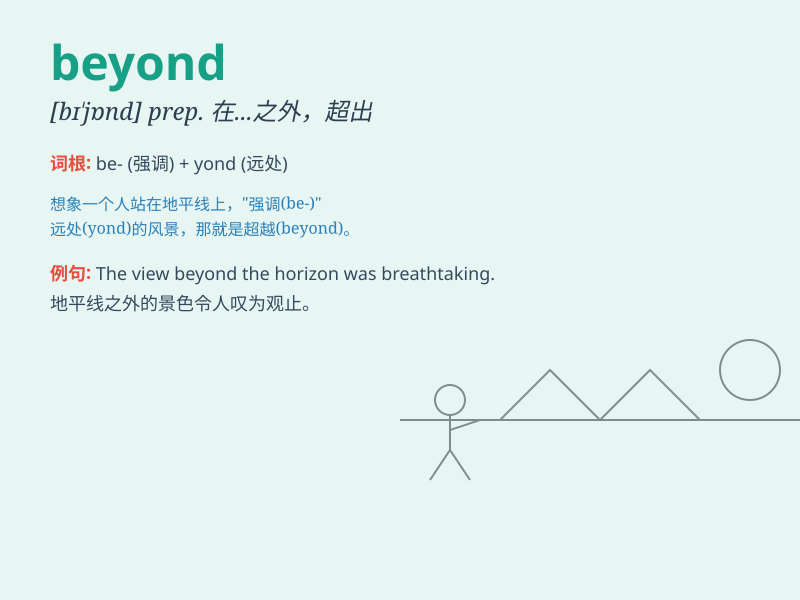

## beyond

**英音:** _[bɪ\'jɒnd]_ **美音:** _[bɪ\'jɑnd]_

**译义:** * prep.在(到)\...较远的一边,超过,那一边adv.在远处n.远处*

### 短语

+ **beyond doubt:** _毫无疑问；确定无疑_

+ **beyond measure:** _无可估量；极度_

+ **beyond compare:** _无与伦比；无可比拟_

+ **beyond belief:** _难以置信_

+ **beyond control:** _失控；无法控制_

### 例句

#### 例句1

> **The beauty of this landscape is beyond description.**

**中文翻译:** 这风景的美丽是无法描述的。

**单词释义:** 超过；超越

#### 例句2

> **The problem is beyond my ability to solve.**

**中文翻译:** 这个问题超出了我的解决能力。

**单词释义:** 超出；超越

#### 例句3

> **What he did was beyond the pale.**

**中文翻译:** 他的所作所为实在是太过分了。

**单词释义:** 超出；越出

### 背诵小故事

> A brave astronaut was on a mission. He flew beyond the known planets
and discovered a new world. \'Beyond\' here means farther than or
outside the limits of.

**一位勇敢的宇航员执行任务。他飞到了已知行星之外，发现了一个新世界。'beyond'在这里指的是在......之外或超出......的范围。**

### 图义

