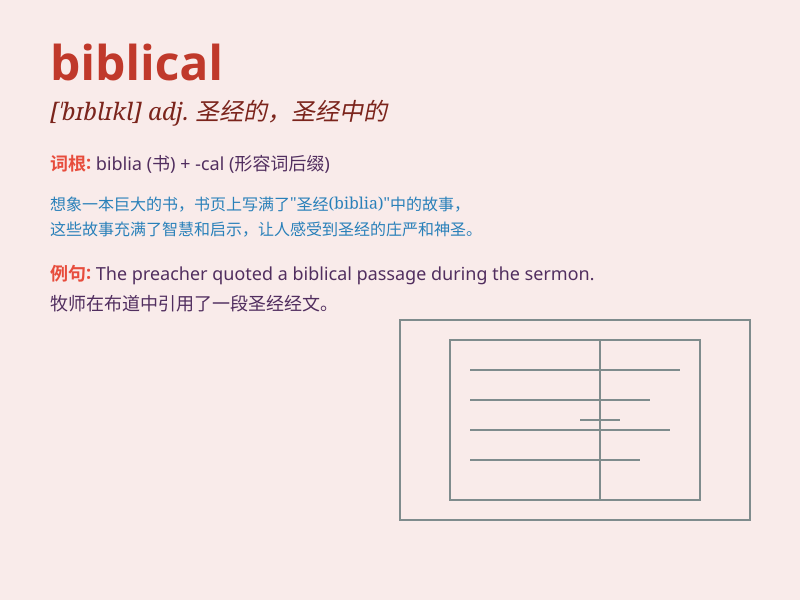

## biblical

**英音:** _[\'bɪblɪk(ə)l]_ **美音:** _[\'bɪblɪkl]_

**译义:** *adj.圣经的*

### 短语

+ **biblical times:** _圣经时代_

+ **biblical studies:** _圣经研究_

+ **biblical story:** _圣经故事_

+ **biblical language:** _圣经语言_

+ **biblical interpretation:** _圣经解释_

### 例句

#### 例句1

> **The professor\'s lecture on biblical history was fascinating.**

**中文翻译:** 这位教授关于圣经历史的讲座很吸引人。

**单词释义:** 与圣经有关的

#### 例句2

> **She has a deep knowledge of biblical stories.**

**中文翻译:** 她对圣经故事有很深的了解。

**单词释义:** 圣经的

#### 例句3

> **The film draws inspiration from biblical themes.**

**中文翻译:** 这部电影从圣经主题中汲取灵感。

**单词释义:** 源自圣经的

### 背诵小故事

> A young scholar was deeply attracted by ancient texts. One day, he
found a mysterious book filled with Biblical stories. The tales were so
fascinating that he never forgot the word \'biblical\'.

**一位年轻的学者被古代文献深深吸引。有一天，他发现了一本充满圣经故事的神秘书籍。这些故事如此迷人，以至于他永远记住了'biblical'这个词。**

### 图义

