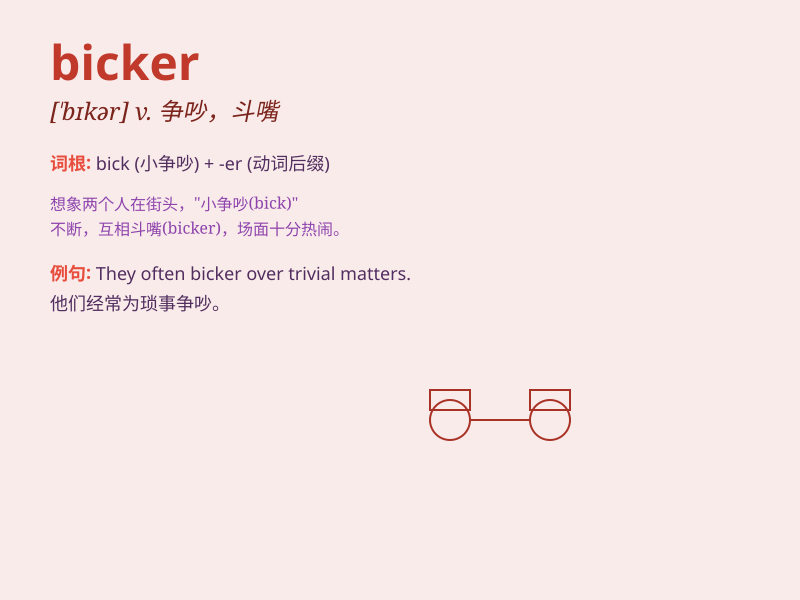

## bicker

**英音:** _[\'bɪkə]_ **美音:** _[\'bɪkɚ]_

**译义:** *vi.斗嘴,流动,闪动n.口角,流水声*

### 短语

+ **bicker over:** _为\...\...争吵_

+ **bicker constantly:** _不断争吵_

+ **bicker among:** _在\...\...中间争吵_

+ **bicker with someone:** _与某人争吵_

+ **bicker about something:** _为某事争吵_

### 例句

#### 例句1

> **The children were bickering over which TV show to watch.**

**中文翻译:** 孩子们为看哪个电视节目而争吵。

**单词释义:** 争吵，斗嘴

#### 例句2

> **The couple often bicker about household chores.**

**中文翻译:** 这对夫妇经常为家务琐事争吵。

**单词释义:** 为\...争吵

#### 例句3

> **The two friends bickered for a while, but then made up.**

**中文翻译:** 这两个朋友争吵了一会儿，但后来和好了。

**单词释义:** 争吵

### 背诵小故事

> Two little rabbits were always bicker ing over a carrot in the
garden. They kept arguing and fighting for it. Finally, they understood
sharing is better. Remember, bicker means to quarrel or argue over small
matters.

**两只小兔子总是在花园里为一根胡萝卜而争吵。它们不停地争论和抢夺。最后，它们明白了分享更好。记住，bicker
意思是为小事争吵或争论。**

### 图义

