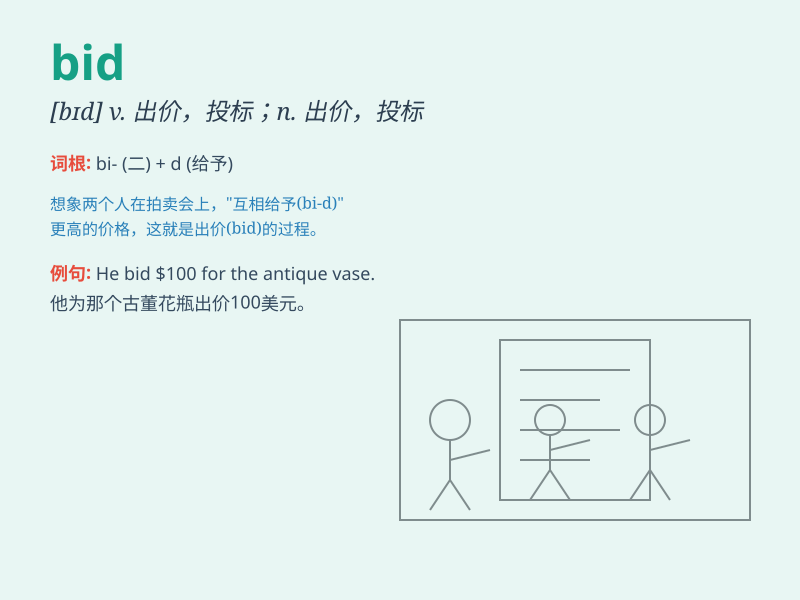

## bid

**英音:** _[bɪd]_ **美音:** _[bɪd]_

**译义:** *vt.出价,投标,祝愿,命令,吩咐n.出价,投标v.支付*

### 短语

+ **bid for:** _投标争取；出价竞买_

+ **bid up:** _（通过竞相出价）抬高（价格）_

+ **make a bid:** _出价；投标_

+ **bid farewell:** _告别；道别_

+ **bid against:** _与\...\...竞争出价_

### 例句

#### 例句1

> **He made a bid of \$500 for the painting.**

**中文翻译:** 他出价 500 美元买这幅画。

**单词释义:** 出价

#### 例句2

> **The company is bidding for the contract.**

**中文翻译:** 这家公司正在投标争取那份合同。

**单词释义:** 投标

#### 例句3

> **She bid him goodbye.**

**中文翻译:** 她向他道别。

**单词释义:** 道别

### 背诵小故事

> A little girl was at an auction. She raised her hand and made a bid
for a beautiful doll. But someone else made a higher bid. Finally, she
saved enough money and won the bid for the doll she loved.

**一个小女孩在拍卖会上。她举手为一个漂亮的娃娃出价。但有人出了更高的价。最后，她攒够了钱，成功中标得到了她心爱的娃娃。**

### 图义

