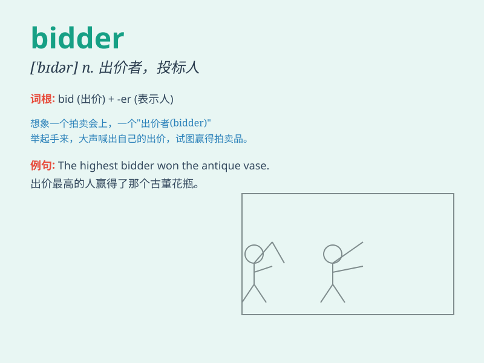

## bidder

**英音:** _[\'bɪdə]_ **美音:** _[\'bɪdɚ]_

**译义:** *n.出价人,投标人*

### 短语

+ **successful bidder:** _中标者；成功的出价人_

+ **potential bidder:** _潜在的投标者_

+ **lowest bidder:** _最低出价者_

+ **highest bidder:** _最高出价者_

+ **competitive bidder:** _有竞争力的投标者_

### 例句

#### 例句1

> **The highest bidder will win the auction.**

**中文翻译:** 出价最高者将赢得这次拍卖。

**单词释义:** 出价者；投标者

#### 例句2

> **Several bidders are competing for the contract.**

**中文翻译:** 几个投标者正在竞争这份合同。

**单词释义:** 投标者；出价人

#### 例句3

> **The bidder offered a very attractive price.**

**中文翻译:** 这位投标者给出了一个非常有吸引力的价格。

**单词释义:** 投标者；出价人

### 背诵小故事

> In an auction, a mysterious person kept raising the price. Everyone
wondered who this determined bidder was. Finally, it was revealed that
it was a collector passionate about the item up for bid.

**在一场拍卖会上，一个神秘的人不断提高价格。大家都好奇这个坚决的出价者是谁。最后发现，原来是一位热衷于竞拍物品的收藏家。**

### 图义

