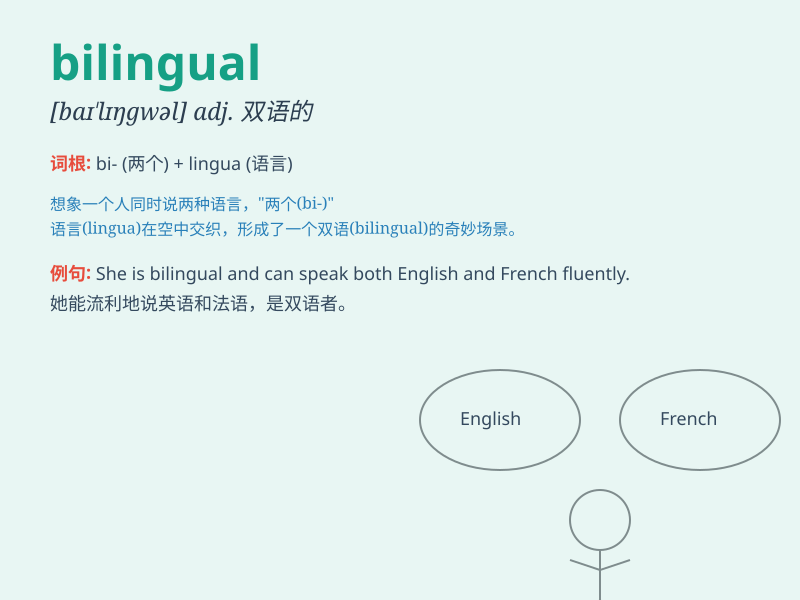

## bilingual

**英音:** _[baɪ\'lɪŋgw(ə)l]_ **美音:**
_[\'baɪ\'lɪŋgwəl]_

**译义:** *adj.能说两种语言的*

### 短语

+ **bilingual education:** _双语教育_

+ **bilingual dictionary:** _双语词典_

+ **bilingual speaker:** _说双语的人_

+ **bilingual ability:** _双语能力_

+ **bilingual text:** _双语文本_

### 例句

#### 例句1

> **She is bilingual in English and Spanish.**

**中文翻译:** 她会说英语和西班牙语。

**单词释义:** 能说两种语言的

#### 例句2

> **The company requires bilingual employees for this position.**

**中文翻译:** 该公司需要双语员工担任该职位。

**单词释义:** 能说两种语言的

#### 例句3

> **Bilingual education is becoming more popular in many
countries.**

**中文翻译:** 双语教育在许多国家越来越受欢迎。

**单词释义:** 双语的

### 背诵小故事

> Once upon a time, there was a girl named Lily. She could speak both
English and French fluently. People called her bilingual Lily because
she had the amazing ability to communicate well in two languages.

**从前，有个叫莉莉的女孩。她能流利地说英语和法语。人们称她为双语莉莉，因为她有能用两种语言很好交流的惊人能力。**

### 图义

