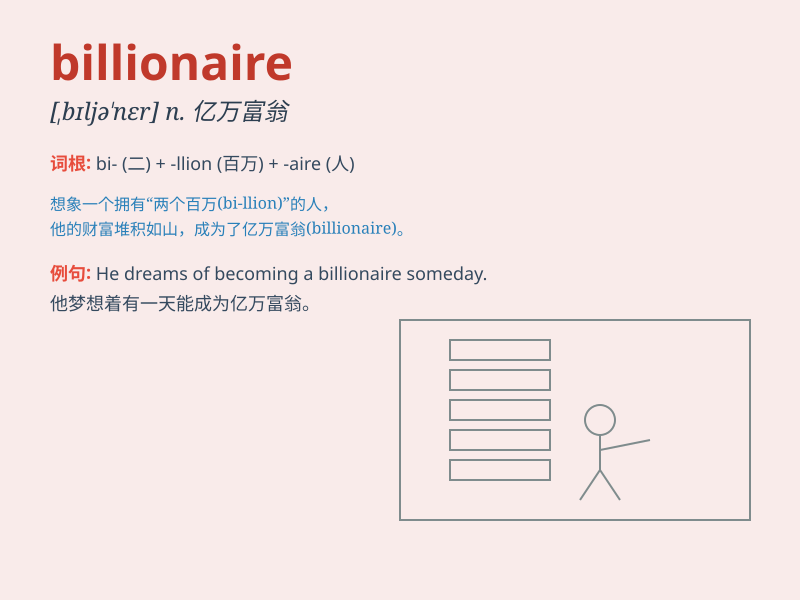

## billionaire

**英音:** _[bɪljə\'neə]_ **美音:** _[,bɪljə\'nɛr]_

**译义:** *n.亿万富翁*

### 短语

+ **self-made billionaire:** _白手起家的亿万富翁_

+ **tech billionaire:** _科技亿万富翁_

+ **billionaire entrepreneur:** _亿万富翁企业家_

+ **billionaire investor:** _亿万富翁投资者_

+ **young billionaire:** _年轻的亿万富翁_

### 例句

#### 例句1

> **Elon Musk is a well-known billionaire in the tech industry.**

**中文翻译:** 埃隆·马斯克是科技行业著名的亿万富翁。

**单词释义:** 亿万富翁

#### 例句2

> **The billionaire donated a large sum of money to charity.**

**中文翻译:** 这位亿万富翁向慈善机构捐赠了大量资金。

**单词释义:** 亿万富翁

#### 例句3

> **She married a billionaire and led a luxurious life.**

**中文翻译:** 她嫁给了亿万富翁，过着奢华的生活。

**单词释义:** 亿万富翁

### 背诵小故事

> A poor boy named Tom always dreamed of becoming a billionaire.
Through years of hard work and smart decisions, he finally achieved it.
Now he has countless wealth and lives a happy life.

**一个叫汤姆的穷小子一直梦想成为亿万富翁。经过多年的努力工作和明智决策，他终于做到了。现在他拥有数不清的财富，过着幸福的生活。**

### 图义

