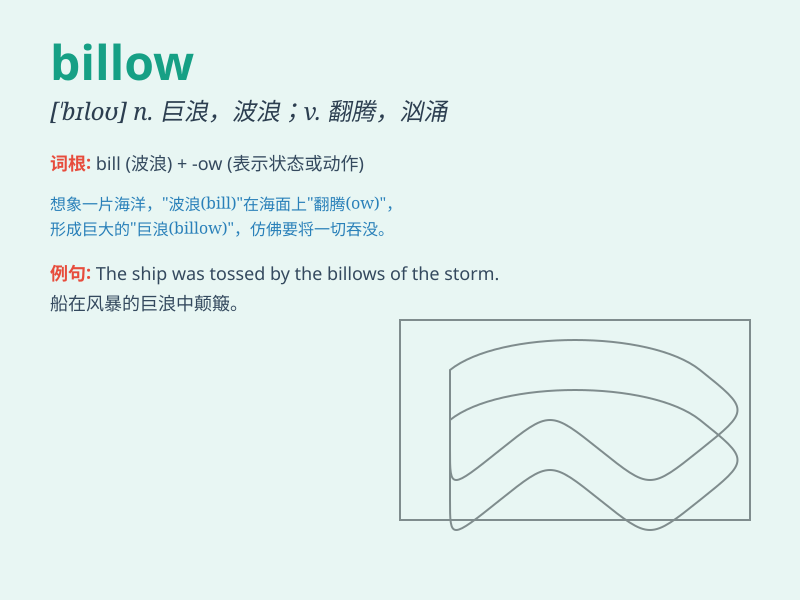

## billow

**英音:** _[\'bɪləʊ]_ **美音:** _[\'bɪlo]_

**译义:** *n.巨浪,波浪般滚滚向前的东西v.翻腾*

### 短语

+ **billow out:** _鼓起；膨胀_

+ **billow up:** _涌起；翻腾_

+ **smoke billow:** _浓烟滚滚_

+ **cloud billow:** _云团翻腾_

+ **billow forth:** _滚滚涌出_

### 例句

#### 例句1

> **The smoke billowed from the chimney.**

**中文翻译:** 烟囱里冒出滚滚浓烟。

**单词释义:** 滚滚冒出

#### 例句2

> **White clouds billowed in the blue sky.**

**中文翻译:** 蓝天白云翻滚。

**单词释义:** 翻腾

#### 例句3

> **The curtains billowed in the breeze.**

**中文翻译:** 窗帘在微风中飘扬。

**单词释义:** 飘动

### 背诵小故事

> A sailor was on the ship. Suddenly, big waves billowed and the ship
rocked hard. The sailor held on tightly, remembering that \'billow\'
means the large movement of waves.

**一位水手在船上。突然，大浪翻腾，船剧烈摇晃。水手紧紧抓住，记住了'billow'是指波浪的大幅运动。**

### 图义

