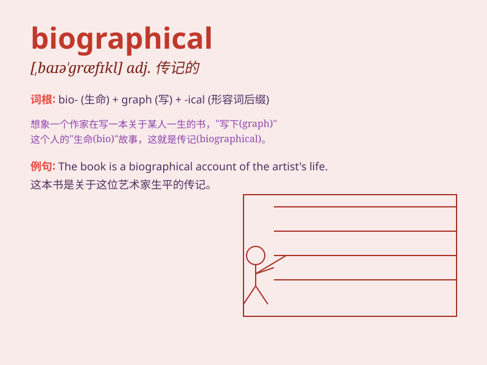

## biographical

**英音:** _[baɪə\'græfɪk(ə)l]_ **美音:**
_[,baɪə\'græfɪkl]_

**译义:** *adj.传记的*

### 短语

+ **biographical data:** _传记资料；生平数据_

+ **biographical film:** _传记片_

+ **biographical sketch:** _传记梗概；小传_

+ **biographical information:** _传记信息_

+ **biographical details:** _传记细节_

### 例句

#### 例句1

> **The book is a biographical account of the singer\'s life.**

**中文翻译:** 这本书是这位歌手一生的传记。

**单词释义:** 传记的；有关生平的

#### 例句2

> **She wrote a biographical novel based on her grandmother\'s
experiences.**

**中文翻译:** 她根据祖母的经历写了一部传记小说。

**单词释义:** 传记的

#### 例句3

> **The museum has a biographical exhibit about the famous
artist.**

**中文翻译:** 博物馆有关于这位著名艺术家的传记展览。

**单词释义:** 有关生平的

### 背诵小故事

> A famous writer was working on a biographical book. He spent days
interviewing the subject\'s friends and family. Through these efforts,
he could paint a vivid and true picture of the person\'s life. Remember,
\'biographical\' is about life stories!

**一位著名的作家正在写一本传记。他花了好几天时间采访主人公的朋友和家人。通过这些努力，他能够描绘出这个人生动真实的一生。记住，\'biographical\'
是关于生平故事的！**

### 图义

