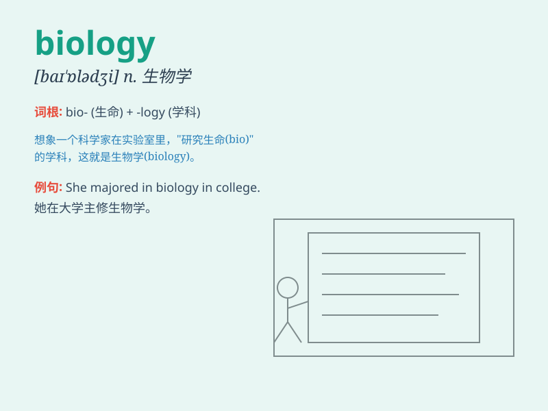

## biology

**英音:** _[baɪ\'ɒlədʒɪ]_ **美音:** _[baɪ\'ɑlədʒi]_

**译义:** *n.生物学,生物(总称)*

### 短语

+ **cell biology:** _细胞生物学_

+ **molecular biology:** _分子生物学_

+ **marine biology:** _海洋生物学_

+ **biology laboratory:** _生物实验室_

+ **plant biology:** _植物生物学_

### 例句

#### 例句1

> **I\'m really interested in biology and want to pursue a career in
this field.**

**中文翻译:** 我对生物学非常感兴趣，并想在这个领域从事职业。

**单词释义:** 生物学

#### 例句2

> **The biology class is very challenging but also fascinating.**

**中文翻译:** 生物课非常具有挑战性，但也很有趣。

**单词释义:** 生物学

#### 例句3

> **She has a deep knowledge of biology, especially in the area of
genetics.**

**中文翻译:** 她对生物学有深入的了解，尤其是在遗传学领域。

**单词释义:** 生物学

### 背诵小故事

> One day, a little scientist was very excited because he was going to
explore the world of BIOLOGY. He wanted to know how living things grow
and change. Biology is like a big mystery box waiting for him to open.

**有一天，一位小科学家非常兴奋，因为他要去探索生物学的世界。他想知道生物是如何生长和变化的。生物学就像一个等着他去打开的大神秘盒子。**

### 图义

